# PII Regex Scanner Workflow

This document explains the scanner logic in detail for:

```text
PiiScraper/run_scanner.py
```

The scanner is evidence-led. It does not start by deciding who a person is. It starts by extracting text, finding atomic regex evidence, grouping evidence that co-occurs in a meaningful unit, clustering those units into inferred people, and optionally linking those inferred people to a supplied person-list table.

## Package Layout

The scanner uses a standard `src` package under `PiiScraper/src/pii_regex_scanner`. `cli.py` provides the package entry point and argument wiring, `runtime.py` orchestrates the execution stages, and the functional implementation is split across domain modules such as `rules.py`, `extraction.py`, `scanning.py`, `summaries.py`, `clustering.py`, `people.py`, `row_overlap.py`, and `validation.py`. `pipeline.py` provides shared runtime state for those modules, while `engine.py` remains only as a compatibility alias to the package pipeline module.

The package can be launched directly with:

```bash
PYTHONPATH=PiiScraper/src python3 -m pii_regex_scanner
```

The standard-library `unittest` suite lives under `PiiScraper/tests`. It includes API-contract checks for the compatibility modules, behavioral unit tests across the scanner domains, and command-line integration coverage.

## Legal Disclaimer And Limitations

This tool uses a rule-based analytical approach to identify and re-identify potential personal data from linked evidence. It is designed to support review and triage, not to provide a definitive legal or forensic determination.

The approach does its best to associate evidence with individuals, but there is an inherent margin for error. False positives and false negatives may be introduced by source-data quality, OCR or text-extraction quality, structured-record boundary inference, regex rule coverage, table-header interpretation, clustering assumptions, repeated/common identifiers, incomplete records, and the supplied person-list table.

We are data analysts rather than data forensic experts. Although we have tried to follow relevant domain best practice when designing the workflow, rules, and outputs, users remain responsible for reviewing the results, validating material findings, and deciding how the outputs should be used. We cannot accept legal liability for decisions, reports, or actions based on this tool's output.

The core model is:

```text
File
  -> extracted text
  -> evidence
  -> linked evidence
  -> person cluster
  -> known or unknown person reporting
  -> individual risk matrices
```

The important distinction is:

```text
Evidence
  = one atomic match
  e.g. Institutional Email = jane.smith@example.ac.uk

Linked evidence
  = evidence values that co-occur in the same meaningful unit
  e.g. one CSV row contains Full Name + Email + DOB + HUSID

Person cluster
  = one or more linked-evidence rows merged by configured identity anchors
  e.g. Email in file A links to Phone in file B

Known person exposure
  = a person cluster, a cluster-excluded linked-evidence row, or a direct raw evidence row matched to a supplied person table

Unknown person in dataset
  = an identity-anchored person cluster that did not match the supplied person table
```

## High-Level Flow

The workflow is shown in smaller sections so that preprocessing, scanning, clustering, reidentification, and reporting remain readable on separate pages.

### Figure 1: Direct CSV streaming separates discovery, clustering, and reidentification into a linear pipeline

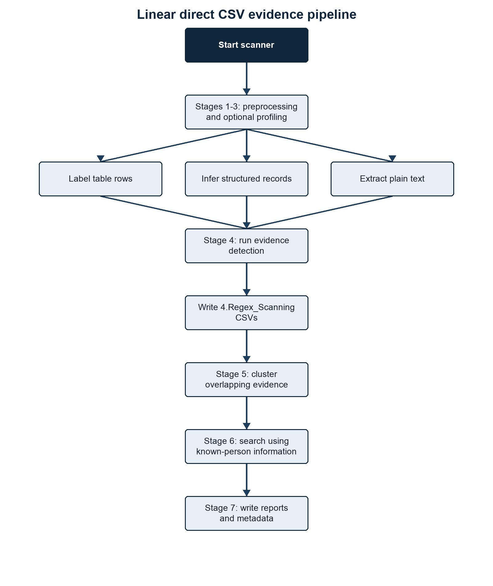{width=80%}

::: {.visual-notes}
**Summary.** The scanner streams discovered evidence to CSV and passes persisted linked-evidence records through distinct processing stages. **Methods/context.** The diagram follows the V0.5 execution path from command-line configuration and optional preprocessing to extraction, atomic evidence CSV writing, linked-evidence CSV writing, clustering, and optional person-table reidentification. **Description.** Reading from top to bottom, the blocks show stage inputs, processing operations, direct CSV artefacts, and reporting outputs. **Statistical details.** No statistical inference is performed; counts and risk values are deterministic summaries of detected evidence. **Definitions.** A source unit is one scanable line or structured record, while reidentification is the comparison of identity-qualified clusters and other anchor-bearing evidence with a supplied person-list table.
:::

### Clustering

The clustering stage merges linked evidence rows into inferred people using configured identity anchors.

### Figure 2: Identity anchors merge eligible evidence before person-list matching

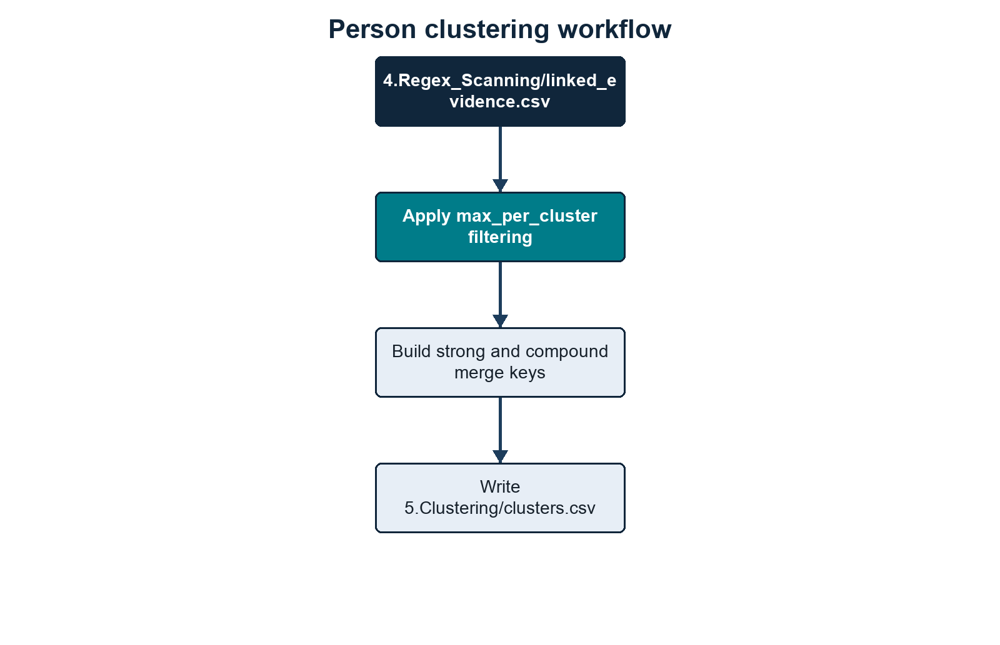{width=80%}

::: {.visual-notes}
**Summary.** Only cluster-eligible evidence that supplies configured identity keys can contribute to cross-record person merging. **Methods/context.** Candidate evidence groups are evaluated against strong and compound anchors before union-find clustering. **Description.** The flow moves from linked evidence through eligibility checks, merge-key generation, cluster construction, and known-person comparison. **Statistical details.** Cluster counts are descriptive outputs; confidence labels are rule-based rather than estimated probabilities. **Definitions.** A strong anchor can form a key by itself, whereas a compound anchor requires every configured evidence type in the set.
:::

### Known And Unknown Person Outputs

Known-person processing compares the discovered dataset against the supplied person table and separates matched and unmatched records. Matching is not limited to final person clusters: Stage 6 first checks inferred clusters, then cluster-excluded linked-evidence rows, then direct atomic evidence rows.

### Figure 3: Known-table matching separates identified people from identity-qualified unknown identities

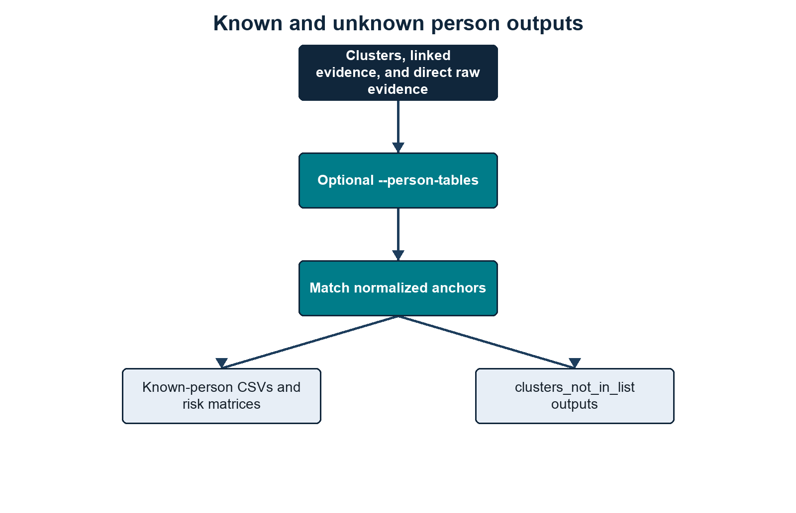{width=80%}

::: {.visual-notes}
**Summary.** Person-table matches produce known-person outputs, while unmatched clusters or strong cluster-excluded anchors are reported as unknown only when they satisfy an identity-anchor rule. **Methods/context.** Cluster values, cluster-excluded linked-evidence values, and direct atomic evidence values are normalized and compared with anchors derived from the supplied person table. **Description.** The branches distinguish known exposure, non-disclosive unknown summaries, sensitive unknown-cluster audits, and optional detailed evidence files. **Statistical details.** Reported counts are exact record counts and do not quantify match uncertainty. **Definitions.** Non-disclosive means that direct discovered PII values are omitted; the sensitive audit retains values needed to explain cluster formation.
:::

## Main Inputs

### `--root`

The folder to scan. Every visible file under this root is considered unless it is hidden and `--include-hidden` has not been set, or the file or one of its folders matches `--exclude`.

The output directory is skipped when it sits inside the scan root, so the scanner does not recursively scan its own CSV outputs.

### `--output-dir`

The folder where output CSVs are written.

The synthetic convention currently used is:

```text
PiiScraper/tests/synthetic_data/outputs/<dataset_name>
```

The current synthetic datasets are:

```text
PiiScraper/tests/synthetic_data/inputs/breach_dump
PiiScraper/tests/synthetic_data/inputs/exposed_dump
```

and their matching output folders are:

```text
PiiScraper/tests/synthetic_data/outputs/breach_dump
PiiScraper/tests/synthetic_data/outputs/exposed_dump
```

### `--rules`

Rules root, regex-rules directory, or legacy single JSON file.

Recommended full-rules layout:

```text
PiiScraper/rules/
  regex_searching/
    contact_location/
    demographics/
    financial/
    identity_documents/
    student_records/
    technical/
  table_column_rules/
    contact_location/
    demographics/
    financial/
    identity_documents/
    name/
    student_records/
  person_identity_anchors.json
```

If `--rules` is omitted, the regex scanner uses only the built-in email rule, plus the built-in minimal table-column defaults needed for conservative structured/header handling. That is deliberately minimal.

Table-column rules are always discovered from `--rules`. When `--rules` points to a rules root, the scanner looks for:

```text
<rules root>/table_column_rules/**/*.json
```

If no table-column rules are supplied, built-in table-header rules are used.

Person-cluster identity merging is also discovered from `--rules`. When `--rules` points to a rules root, the scanner looks for:

```text
<rules root>/person_identity_anchors.json
```

### `--person-tables`

Optional known-person CSV or CSV list.

The person table can be any CSV shape. The scanner no longer requires fixed columns such as `ID`, `UoN email`, `First Name`, or `Last name`.

Person-table CSVs are read with encoding fallbacks for common exports. The scanner accepts UTF-8, UTF-8 with BOM, UTF-16-looking files, Windows-1252, and Latin-1. This avoids failures on non-breaking spaces and other common Excel/Windows CSV characters. The Python CSV field-size limit is raised to the largest value supported by the running interpreter so unusually large individual fields do not trigger `field larger than field limit`.

The scanner:

1. preserves the original person-table columns;
2. carries those original columns through to known-person outputs;
3. treats an exact `ID` column as the person-list table primary key and as an `ID` matching anchor;
4. resolves each other column name through table-column rules where possible;
5. applies the loaded regex rules to each labelled cell;
6. extracts email-looking values regardless of column name;
7. builds matching anchors from the results;
8. combines detected first-name and last-name columns into a full-name `Name` anchor;
9. merges duplicate source rows that resolve to the same internal person key, joining differing source values with ` | `.

### `--email-suffix`

Optional institutional email suffix.

Examples:

```bash
--email-suffix example.ac.uk
--email-suffix nottingham.*
--email-suffix example.ac.uk,nottingham.*
```

If set, the loaded `Email` rule is split at runtime:

```text
Email ending in example.ac.uk -> Institutional Email
All other emails              -> Personal Email
```

The split applies everywhere downstream:

```text
3.Profiling/
4.Regex_Scanning/pii_regex_evidence/
4.Regex_Scanning/file_summary.csv
4.Regex_Scanning/entity_summary.csv
4.Regex_Scanning/regex_summary.csv
4.Regex_Scanning/linked_evidence.csv
5.Clustering/clusters.csv
6.Reidentification/
7.Reporting/run_info.txt
7.Reporting/run_manifest.json
7.Reporting/metadata/process_timing.log
person-list matching
risk matrices
```

The identity-anchor config treats `Email` as an alias that expands to the active email categories. With `--email-suffix`, `Email` expands to:

```text
Institutional Email
Personal Email
```

### `--email-wildcard`

Optional bidirectional email-domain equivalence rule used for matching.

Example:

```bash
--email-wildcard "@nottingham == @exmail.nottingham"
```

This treats addresses such as `a@nottingham.ac.uk` and `a@exmail.nottingham.ac.uk` as equivalent person-matching keys. The rule preserves suffixes and is bidirectional. It affects person-table indexing, raw-evidence matching, linked-evidence matching, reidentification, and strong email cluster merge keys. It does not rewrite the evidence value written to output CSVs.

### `--scan-images`

Defaults to `FALSE`.

Use:

```bash
--scan-images TRUE
```

to OCR image files using `pytesseract`.

When false, image files can still be recorded as file signals, but image OCR text is not extracted.

### Other Runtime Controls

### Table 1: V0.5 exposes operational, preprocessing, extraction, resume, and target-selection controls

| Flag | Purpose |
|---|---|
| `--root` | Input folder. Defaults to `PiiScraper/tests/synthetic_data/inputs/breach_dump`. Visible files are scanned unless excluded; hidden files/folders require `--include-hidden`. |
| `--output-dir` | Output folder. Defaults to `PiiScraper/tests/synthetic_data/outputs`. Outputs are written into numbered stage folders; run metadata is written under `7.Reporting/`. |
| `--rules` | Rules root, `regex_searching` directory, or single JSON rule file. When omitted, the built-in email rule and built-in minimal table-column defaults are used. |
| `--person-tables` | One or more known-person/reference CSV files. Outputs are named from each CSV filename stem. |
| `--email-suffix` | Institutional email suffix or wildcard pattern. The flag can be repeated and values can be comma-separated; `*` is supported, for example `nottingham.*`. |
| `--email-wildcard` | Bidirectional email-domain equivalence rule used for matching, for example `@nottingham == @exmail.nottingham`. The displayed evidence values are preserved. |
| `--scan-images` | Enables OCR for image files when set to `TRUE`. Default is `FALSE`; without OCR, images can still contribute file/document metadata signals where configured. |
| `--workers` | Number of Stage 4 scanning process workers. `0` auto-selects logical CPU count minus one, with a minimum of one worker and no more workers than queued file targets. |
| `--file-preprocessing` | `standalone`, `disabled`, or `integrated`. Default `integrated` discovers, hashes, groups duplicate files, and writes/reuses `1.File_Preprocessing/file.index.json`. `standalone` builds the file index and exits. `disabled` skips file preprocessing. |
| `--discovery-preprocessing` | `standalone`, `disabled`, or `integrated`. Default `integrated` prepares worker-ready rule/person-table discovery artefacts before scanning. `standalone` builds reusable discovery artefacts and exits. `disabled` leaves workers to load raw rules/person tables. |
| `--index-dir` | Reusable index directory. Existing indexes in this folder are trusted and reused; missing indexes are recreated by the relevant preprocessing mode. |
| `--hash-workers` | Process count for Stage 1 content hashing. `0` uses a bounded automatic count derived from the scan worker count. |
| `--nlp` | Enables optional NLP-assisted header/context heuristics for profiling and structured/header-aware scanning. Exact rules, validators, and context guards still control evidence emission. |
| `--profile` | `standalone` runs only profiling; `integrated` runs Stage 3 profiling/schema planning before Stage 4 scanning, uses safe actionable decisions to route rules or emit validated header-confirmed values, and writes `3.Profiling/schema_plan.csv`; `create_rules` creates draft table-column JSON rules from prior profile outputs; `columns` is an alias for `standalone`. |
| `--max-findings-per-file` | Optional cap on evidence rows written per file. `0` means no cap and is the default. Counts still reflect all scanned matches. |
| `--hash-mode` | `duplicate-candidates`, `processed`, `all`, or `none` for content-hash calculation. Default is `duplicate-candidates`, which hashes only processable files whose byte size is shared with another processable file. |
| `--file-hash` | `sha256` or `md5`. Default is `sha256`; `md5` is retained for compatibility with older output comparisons. |
| `--duplicate-files` | `scan`, `report`, or `collapse` for byte-identical files with the same selected content hash. Default is `collapse`: scan the first copy and reuse content-derived evidence rows for duplicate paths while preserving duplicate-file provenance in `file_summary.csv`. `scan` scans every copy. `report` scans the first copy and writes duplicate `file_summary.csv` rows only. The older `--duplicate-content` flag and `reuse` value are accepted as aliases. |
| `--duplicate-evidence` | `scan`, `report`, or `collapse` for semantically identical linked-evidence units after scanning. Default is `collapse`: write one `linked_evidence.csv` row per duplicate evidence group with provenance. `report` writes all linked rows with duplicate provenance. `scan` writes every linked row independently. Atomic evidence CSVs are not collapsed. |
| `--large-file-cutoff-mb` | Split XML, JSONL, CSV, and TSV files into parallel scan units only at or above this size in MB. Default is `100`; `0` disables large-file scan units. Compatibility aliases `--large-file-cuttoff-mb` and `--large-file-threshold-mb` are accepted. |
| `--scan-unit-records` | Approximate records per large-file scan unit. Default is `1000`. |
| `--progress-every` | Seconds between heartbeat updates during preprocessing, profiling, scanning, clustering, reidentification, and reporting. Long-running worker waits emit Stage 4 heartbeats. |
| `--write-person-evidence` | Writes optional per-person detail folders when set to `TRUE`. Default is `FALSE`. |
| `--structured-max-depth` | Maximum nesting depth inspected while inferring structured records. Default is `12`. |
| `--xml-max-fields` | Maximum labelled fields retained per XML evidence scope or structured record. Default is `200`. |
| `--xml-scan` | `fast` builds bounded XML evidence scopes from raw XML text and is the default; `structured` uses the structured XML extraction path. |
| `--resume STAGE` | Reuses existing upstream artefacts and resumes from `discovery`, `profiling`, `scanning`, `clustering`, `reidentification`, or `reporting`. Stage 1 file preprocessing has no resume flag; use `--file-preprocessing standalone` to build only the file index. |
| `--exclude PATH [PATH ...]` | Excludes files or folders from traversal. Bare names and relative multi-part path suffixes match at any depth; absolute paths match exactly. Both `/` and `\` separators are accepted. The flag may be repeated. |
| `--priority` | Scan submission order: `discovery` (default), `alphabetical`, `size` (largest first), or `type` (grouped by extension). With integrated file preprocessing or a reusable file index, progress has an exact file denominator; with file preprocessing disabled, targets stream directly to Stage 4. |
| `--include-hidden` | Includes dot-prefixed files and folders. |

::: {.visual-notes}
**Summary.** The command line controls execution, preprocessing, and extraction behavior without changing the persisted rule definitions. **Methods/context.** Options are read by the V0.5 argument parser before preprocessing or discovery begins. **Description.** The left column gives each flag and the right column states its effect, accepted values, or default. **Statistical details.** Numeric values are configuration limits or intervals, not estimates; `0` denotes no cap where explicitly stated. **Definitions.** A resume stage reuses valid direct-streaming CSV outputs and rebuilds downstream products.
:::

## Rule Loading

Rule loading happens before files are scanned. It also happens inside worker processes so each worker has the same compiled configuration.

### Figure 4: Deterministic rule-loading order keeps identity, regex, and table configuration consistent

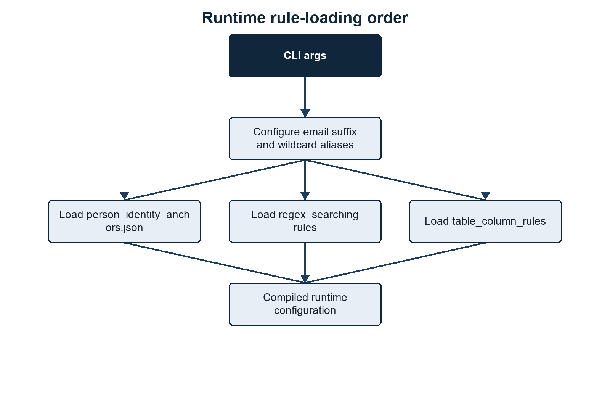{width=80%}

::: {.visual-notes}
**Summary.** Runtime behavior is reproducible because configuration is loaded in a fixed dependency order. **Methods/context.** Startup first applies the email suffix and email wildcard configuration, then identity anchors, regex rules, and table-column rules. **Description.** Each block represents one configuration step and the arrows show which derived settings must exist before the next step is built. **Statistical details.** No statistical operations occur during rule loading. **Definitions.** Rule-derived configuration means compiled regexes and semantic sets reconstructed from persisted JSON metadata.
:::

### Figure 5: Rule metadata generates the evidence, risk, and anchor collections used throughout scanning

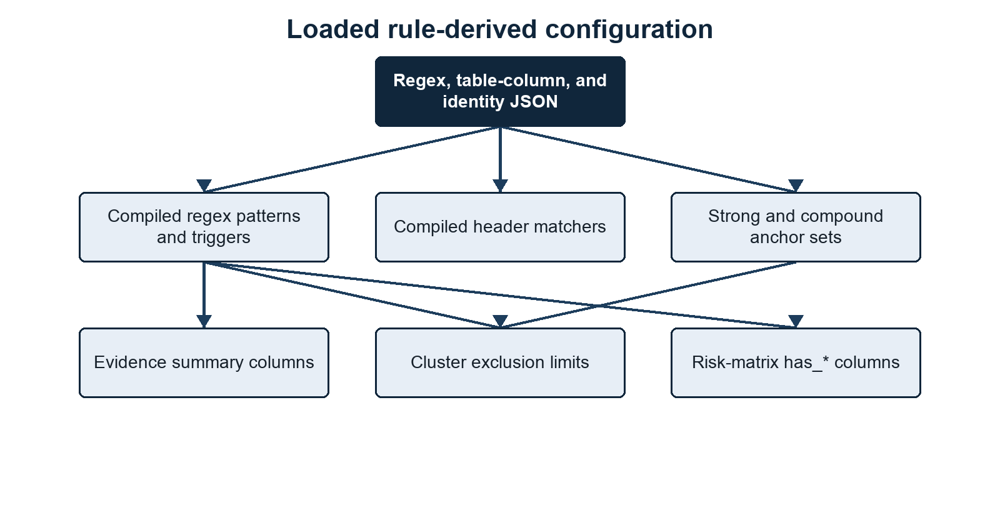{width=80%}

::: {.visual-notes}
**Summary.** A small set of rule files expands into the runtime collections used for detection, summaries, risk scoring, and identity linkage. **Methods/context.** The loader validates rule metadata and rebuilds evidence types, normalization strategies, risk roles, tiers, and anchor priorities. **Description.** The diagram groups derived collections by the downstream behavior they control. **Statistical details.** These collections are categorical configuration, not fitted parameters. **Definitions.** A risk role is a semantic label such as email, name, or ID that lets differently named evidence types participate in common scoring logic.
:::

The order matters:

1. Email suffixes and email wildcard aliases are configured first.
2. Identity anchors are loaded so the scanner knows which evidence types can be used for person merging.
3. Regex rules are loaded.
4. `max_per_cluster` values are read only for evidence types used by identity anchors.
5. Table-column rules are loaded for table extraction and person-table matching.

## Regex Search Rules

Regex search rules live under:

```text
rules/regex_searching/**/*.json
```

Each file should contain one rule object.

Example:

```json
{
  "evidence_type": "DOB",
  "pattern_name": "demographics_dob_context",
  "confidence": "high",
  "regex": "\\b(?:date\\s*of\\s*birth|birth\\s*date|dob)\\b\\s*[:=#-]?\\s*(?P<value>\\d{4}-\\d{2}-\\d{2}|\\d{1,2}[/-]\\d{1,2}[/-]\\d{2,4})\\b",
  "flags": ["IGNORECASE"],
  "risk_tier": "tier_2_sensitive_contextual",
  "validator": "valid_contextual_date",
  "line_triggers": ["date of birth", "birth date", "dob"],
  "max_per_cluster": 3
}
```

### Regex Rule Fields

### Table 2: Regex rule metadata controls detection, validation, normalization, risk, and clustering limits

| Field | Required | Used for |
|---|---:|---|
| `evidence_type` | yes | The category written to outputs, such as `DOB`, `Name`, `Phone`, or `Passport`. |
| `pattern_name` | yes | Stable rule identifier used in output file names and summaries. |
| `regex` | yes | Python regex string. |
| `flags` | no | Regex flags: `IGNORECASE`, `MULTILINE`, `DOTALL`, `ASCII`. |
| `confidence` | no | Review label written to evidence outputs. Defaults to `medium`. |
| `risk_tier` | no | Tier used to derive file risk, matrix columns, and risk logic. Defaults to tier 3. |
| `validator` | no | Name of an allowed internal validator function. |
| `line_triggers` | no | Fast lowercase substring checks before running contextual regexes on a line. |
| `labelled_fields_only` | no | Restricts a rule to generated table rows and structured JSON, JSONL, XML, or YAML records. Plain free-text lines are not searched by that rule. |
| `max_per_cluster` | no | Maximum distinct values of this type allowed in one linked-evidence row before that row is excluded from clustering. |
| `max_per_cluster_by_evidence_type` | no | Email-specific override when `Email` is split into `Institutional Email` and `Personal Email`. |
| `normalization` | no | Normalization strategy for stored terms: `none`, `lower`, or `compact_upper`. |
| `is_identifiable` | no | Whether this evidence type can identify a person when combined with sensitive context. |
| `is_high_risk_standalone` | no | Whether this evidence type is high risk without any other evidence type. |

::: {.visual-notes}
**Summary.** Each regex rule combines a required detection identity with optional controls for validation and downstream interpretation. **Methods/context.** JSON objects are validated and compiled when rules are loaded. **Description.** Columns identify the field name, whether it is mandatory, and the behavior it controls. **Statistical details.** Confidence and risk tiers are configured labels rather than empirically calibrated probabilities. **Definitions.** Normalization standardizes stored values, while `max_per_cluster` limits ambiguous multi-value evidence groups before clustering.
:::

Default/no-op rule metadata should be omitted. Missing `normalization` behaves as `none`, and missing booleans behave as `false`.

Address evidence is not produced by a loose postcode regex rule. It is code-derived only from labelled table or structured-record fields. A syntactically valid UK postcode must appear with at least one searchable address component. The scanner closes the current address group whenever it reaches a postcode, so sequential home/current/term groups on one source row emit separate `Address` findings rather than one synthetic merged address. Free-text address assembly is intentionally disabled because it produced too many false positives. Standalone postcodes are deliberately not reported as addresses.

Name evidence is also code-derived rather than produced by a free-text regex. Explicit full-name fields are accepted, while recognised first/last, given/family, or forename/surname fields are assembled within their field group. Repeated values separated by semicolons, pipes, or spaced slashes are paired positionally; one shared first or last name may be reused, but ambiguous unequal lists are rejected rather than combined as a cross-product. Prefixes such as applicant and guardian keep separate name groups. Name matching is case-insensitive after whitespace, title, apostrophe, and `Surname, Given` normalization. Unlabelled names in free text are not reported.

The generic technical `Date` search is not loaded in the default rules because it is too permissive for PII triage. Date-like values should be reported through contextual rules such as DOB.

CAS evidence is restricted to labelled `CAS`, `CAS number`, `CAS no`, or `CAS id` fields. The captured value must be exactly 14 uppercase alphanumeric characters and contain at least one letter and one digit. The label match is case-insensitive, but lowercase, hyphenated, short, long, or unlabelled CAS-like values are rejected.

Risk roles are derived from `evidence_type` in the scanner. Current rule files do not need to carry explicit role lists. The built-in derived roles are:

### Table 3: Derived semantic roles connect evidence categories to scoring and linkage behavior

| Evidence type | Derived role |
|---|---|
| `Address` | `address` |
| `DOB` | `dob` |
| `Email`, `Institutional Email`, `Personal Email` | `email` |
| `ID` | `id` |
| `Name` | `name` |
| `Payment Card` | `payment_card` |
| `Phone` | `phone` |
| `Application Number` | `application_reference` |

::: {.visual-notes}
**Summary.** Evidence categories with different display names can share one semantic role in risk and linkage logic. **Methods/context.** The scanner derives these roles from evidence-type names during rule loading. **Description.** Each row maps a reported evidence type to the internal role consumed by downstream conditions. **Statistical details.** The mapping is deterministic and contains no weights or estimated effects. **Definitions.** An evidence type is the output category; a derived role is its code-level semantic function.
:::

### Active Search Rule Catalogue

The following catalogue describes every active JSON search rule under `rules/regex_searching`. Contextual rules require their label or trigger text; standalone rules run against every extracted line.

#### Contact And Location Rules

##### Email (`contact_location_email`)

Matches conventional email addresses case-insensitively and normalises them to lowercase. It is a high-confidence tier 1 identifier and runs on every line. With `--email-suffix`, matches become `Institutional Email` or `Personal Email`. A linked row may contain at most three institutional or five personal email values before cluster exclusion.

##### UK Phone (`contact_location_uk_phone`)

Matches UK-looking telephone numbers beginning with `0` or `+44`, including common mobile and geographic layouts. `valid_uk_phone_rough` requires 10 or 11 non-repeating digits after converting `44` to a leading zero. It is medium-confidence tier 3 supporting evidence and permits up to ten values per cluster candidate.

#### Demographic Rules

##### Citizenship/Country (`demographics_citizenship_country_context`)

Captures a value only from a labelled table column or structured-record field named citizenship, nationality, country-of-birth/residence/domicile, domicile, or country. It does not search ordinary free text. It is medium-confidence tier 2 sensitive evidence and permits up to five values.

##### Disability (`demographics_disability_context`)

Captures a value only from a labelled table column or structured-record field named disability, disabled, accessibility, or reasonable adjustment. It does not search ordinary free text. It is medium-confidence tier 2 sensitive evidence and permits up to ten values.

##### DOB (`demographics_dob_context`)

Captures ISO dates or slash/hyphen day-first dates following date-of-birth, birth-date, or DOB labels. `valid_contextual_date` requires a real date within the rolling 100-year window ending on the scan date. It is high-confidence tier 2 sensitive evidence and permits up to three values.

##### Ethnicity (`demographics_ethnicity_context`)

Captures text following ethnicity, ethnic-group, or race labels. It is medium-confidence tier 2 sensitive evidence, uses those labels as triggers, and permits up to ten values.

##### Gender/Sex (`demographics_gender_context`)

Captures a controlled set of values following gender or sex labels: male, female, non-binary variants, other, prefer not to say, `M`, or `F`. It is medium-confidence tier 2 sensitive evidence and permits up to two values.

##### Religion (`demographics_religion_context`)

Captures a value only from a labelled table column or structured-record field named religion, religious belief, or faith. It does not search ordinary free text. It is medium-confidence tier 2 sensitive evidence and permits up to ten values.

#### Financial Rules

##### UK Sort Code And Account (`financial_uk_sort_code_account_context`)

Captures a six-digit UK sort code together with an eight-digit account number after a sort-code or bank-sort label. It accepts common separators and optional account-number wording, then applies compact uppercase normalisation. It is high-confidence tier 1, identifiable, high risk as standalone evidence, and permits up to three values.

##### Payment Card (`financial_payment_card_number`)

Matches 13 to 19 digits with optional spaces or hyphens on every line. `valid_luhn` removes separators, rejects repeated single-digit sequences, and requires a valid Luhn checksum. It is high-confidence tier 1 and high risk as standalone evidence, with a three-value cluster limit.

##### UK UTR (`financial_uk_utr_context`)

Captures exactly ten digits after `UTR` or `unique taxpayer reference`. It is high-confidence tier 1 identifiable evidence, uses those labels as line triggers, and permits up to three values. The rule validates format only; it does not perform an HMRC lookup or checksum.

#### Identity Document Rules

##### Chinese National ID (`identity_documents_china_national_id`)

Matches standalone 18-character Chinese resident identity numbers. `valid_china_national_id` checks the encoded birth date against the rolling 100-year window and validates the final checksum character. It is high-confidence tier 1, identifiable, and high risk as standalone evidence.

##### GB Driving Licence (`identity_documents_uk_driving_licence_context`)

Captures the stable 16-character driver number after driving/driver licence labels and consumes, but does not store, an optional two-digit issue number. `valid_uk_driving_licence` validates the encoded birth year, gender-adjusted month, and day within the rolling 100-year assumption. It is high-confidence tier 1, identifiable, and high risk as standalone evidence.

##### UK National Insurance Number (`identity_documents_uk_national_insurance_number`)

Matches standalone NINO format: two permitted prefix letters, six digits, and suffix `A` to `D`, excluding the disallowed prefixes encoded in the regex. `valid_uk_national_insurance_number` also rejects repeated six-digit dummy sequences, so values such as `AA999999A` do not pass. It is high-confidence tier 1, identifiable, and high risk as standalone evidence. No external allocation lookup is performed.

##### NHS Number (`identity_documents_nhs_number`)

Captures ten digits after an NHS label with optional grouping spaces or hyphens. `valid_nhs_number` applies the NHS modulus-11 checksum and rejects repeated-digit values. It is high-confidence tier 1, identifiable, and high risk as standalone evidence.

##### Passport (`identity_documents_passport_context`)

Captures 6 to 12 alphanumeric characters after a passport label. `valid_passport_like` rejects status words and requires at least one digit. It is high-confidence tier 1, identifiable, and high risk as standalone evidence, but it is intentionally a contextual multi-country format check rather than authoritative passport validation.

#### Student Record Rules

##### CAS Number (`student_records_cas_number_context`)

Captures exactly 14 uppercase alphanumeric characters after a CAS label and a required `:`, `=`, or `#` separator. `valid_cas_number` requires at least one letter and one digit. It is high-confidence tier 1 and high risk as standalone evidence.

##### HUSID (`student_records_husid_context`)

Captures exactly 13 digits after a HUSID label. `valid_husid_entry_year` checks that the leading two-digit year can represent a year of entry within the rolling 100-year window. It is high-confidence tier 1 identifiable evidence. The validator does not currently implement the legacy HUSID check-digit algorithm.

##### SLC ID (`student_records_slc_id_context`)

Captures 6 to 20 alphanumeric characters after an SLC, SLC ID, SLC number, or SLC no label. It is high-confidence tier 1 identifiable evidence with compact uppercase normalisation. This is a broad contextual institutional rule and does not validate against Student Loans Company systems.

##### Student SSN (`student_records_student_ssn_context`)

Captures a nine-digit US-style SSN, with or without `3-2-4` hyphen grouping, after an SSN or student SSN label. It is high-confidence tier 1, identifiable, and high risk as standalone evidence. The digits do not encode a birth date and no SSA lookup is performed.

#### Technical Rules

##### IPv4 Address (`technical_ipv4`)

Matches four decimal octets from `0` to `255` on every line. It is low-confidence tier 3 supporting evidence and permits up to ten values. It validates syntax only and does not distinguish public, private, reserved, broadcast, or loopback ranges.

#### Code-Derived Evidence

##### Name (`assembled_name`)

Name is not loaded from regex JSON. It is assembled from recognised full-name or paired first/last fields in labelled tables and structured records, normalized case-insensitively, and validated as a multi-word name. It is tier 3 identifiable supporting evidence with a ten-value cluster limit.

##### Address (`assembled_address`)

Address is not loaded from regex JSON. It is assembled from recognised address/locality fields only when accompanied by a syntactically valid UK postcode and a searchable address component. It is tier 3 supporting evidence with a ten-value cluster limit; standalone postcode and free-text address searching are intentionally disabled.

### Validators

Validators are not arbitrary code from JSON.

A rule can contain:

```json
"validator": "valid_uk_postcode"
```

The scanner looks up that name in its internal validator map. If the name is allowed, it calls the Python function after the regex match. If the validator returns `False`, the match is discarded.

Allowed validators currently include:

```text
valid_luhn
valid_nhs_number
valid_ucas_personal_id
valid_cas_number
valid_husid_entry_year
valid_uk_driving_licence
valid_bare_8_digit_id
valid_uk_postcode
valid_contextual_date
valid_passport_like
valid_china_national_id
valid_orcid
valid_uk_phone_rough
```

DOB and date-of-entry validation uses a rolling 100-year window ending on the scan date. Explicit DOB values and the full birth date embedded in a Chinese national ID must be real calendar dates within that window. GB driving-licence numbers validate their encoded year, gender-adjusted month, and day using the same assumption. Legacy 13-digit HUSIDs validate their two-digit year-of-entry component, although a two-digit year cannot independently prove its century across an exactly 100-year window.

#### Validator Behaviour

- `valid_luhn`: requires 13 to 19 digits, rejects a repeated single digit, and applies the Luhn checksum. Used by Payment Card.
- `valid_nhs_number`: requires ten non-repeating digits and applies the NHS modulus-11 checksum. Used by NHS Number.
- `valid_ucas_personal_id`: accepts exactly ten digits after removing non-digits. Available to rules but not used by the current active JSON set.
- `valid_cas_number`: requires exactly 14 uppercase alphanumeric characters containing at least one letter and one digit. Used by CAS Number.
- `valid_husid_entry_year`: requires exactly 13 digits and interprets the leading two digits as a possible entry year in the rolling 100-year window. Used by HUSID.
- `valid_uk_driving_licence`: requires the 16-character GB driver-number structure and validates its encoded date fields. Used by Driving Licence.
- `valid_bare_8_digit_id`: requires eight non-repeating digits and rejects obvious sequences and values shaped like common eight-digit dates. Available to rules but not used by the current active JSON set.
- `valid_uk_postcode`: applies the scanner's UK postcode syntax, including `GIR 0AA`. Used internally by address assembly rather than by an active regex JSON rule.
- `valid_contextual_date`: parses the supported DOB formats and requires a real date in the rolling 100-year window. Used by DOB.
- `valid_passport_like`: requires 6 to 12 alphanumeric characters, at least one digit, and rejects configured administrative status words. Used by Passport.
- `valid_china_national_id`: validates 18-character structure, embedded birth date, rolling date window, and checksum. Used by Chinese National ID.
- `valid_orcid`: applies the ISO 7064 MOD 11-2 checksum to a 16-character ORCID representation. Available to rules but not used by the current active JSON set.
- `valid_uk_phone_rough`: normalises a leading country code, requires 10 or 11 non-repeating digits, and requires a leading zero. Used by UK Phone.

Unknown validator names cause startup to fail.

### `line_triggers`

`line_triggers` are not table-column rules.

They are a performance filter for regex scanning. If a regex is broad and contextual, the scanner only runs it on lines containing at least one trigger term.

Example:

```json
"line_triggers": ["student id", "student number", "student no"]
```

If a line does not contain one of those strings, that rule is skipped for that line.

Rules without `line_triggers` run on every line.

### Evidence Types Are Derived From Rules

The loaded regex rules and the code-derived Name and Address definitions are the source of evidence categories.

From `evidence_type`, `risk_tier`, and rule metadata, the scanner builds:

```text
EVIDENCE_COUNT_TYPES
EVIDENCE_COUNT_COLUMNS
EVIDENCE_FLAG_COLUMNS
EVIDENCE_NORMALIZATION
EVIDENCE_RISK_ROLES
TIER_1_EVIDENCE
TIER_2_EVIDENCE
TIER_3_EVIDENCE
IDENTIFIABLE_EVIDENCE
HIGH_RISK_STANDALONE
ID_EVIDENCE_TYPES
ANCHOR_PRIORITY
file_summary.csv count_* columns
<person-list-stem>_risk_matrix.csv has_* columns
clusters_not_in_list_risk_matrix.csv has_* columns
```

This means removed rules should not appear in new summary outputs unless stale output files are still being viewed, another loaded rule emits that evidence type, or the evidence type is one of the active code-derived definitions.

Risk logic uses these derived sets and evidence-type roles. For example, `Email + DOB` is evaluated as roles `email` and `dob`, not as hard-coded output column names. `Payment Card`-style logic is triggered by the derived `payment_card` role and high-risk standalone logic is triggered by `is_high_risk_standalone`.

The scanner still supports legacy `risk_roles` in JSON, but the current `rules/regex_searching/**/*.json` files do not use it. Prefer deriving roles from `evidence_type` unless the scanner code is deliberately extended with a new semantic role.

File-signal evidence is also gated by the active rule-derived evidence types. For example, the scanner only emits image extension evidence when `Pictures` is present in the loaded evidence types, and only emits document extension evidence when `Document Info` is present. It can also emit `Identity Document File` when a filename or document-metadata value indicates a passport, visa, BRP, residence permit, national ID card, driving licence, or birth certificate. That signal means the source appears to contain an identity document file; it is not an OCR extraction of document contents. Filename- and metadata-only document evidence is deliberately conservative: generic names such as `passport.pdf` or `passport_photo.jpg` are not sufficient, values containing email addresses are rejected, and the value must contain a document cue plus plausible owner-name context. If OCR is enabled, extracted OCR text is scanned through the normal evidence path and can link through actual names, document numbers, emails, or other anchors found in the document.

## Table-Column Rules

Table-column rules live under:

```text
rules/table_column_rules/**/*.json
```

They are grouped in folders in the same spirit as `regex_searching`.

Example:

```json
{
  "canonical_header": "student id",
  "pattern_name": "student_records_student_id_column",
  "header_patterns": [
    "\\bstudent\\s*(?:id|number|no)\\b"
  ]
}
```

Most current table-column rules use `canonical_header`, `pattern_name`, and `header_patterns`. The loader also still accepts older `header_terms` rules for compatibility with older rule bundles, but new rules should prefer explicit `header_patterns` plus any needed validators, emit-cell settings, or context guards.

Another example for split names:

```json
{
  "canonical_header": "first name",
  "pattern_name": "name_first_name_column",
  "name_part": "first",
  "header_patterns": [
    "\\b(?:first|given|forename)\\s*names?\\b"
  ]
}
```

### What Table-Column Rules Do

Table-column rules do three things:

1. Decide whether headers look like an individual-data table.
2. Resolve messy source headers to canonical labels.
3. Add metadata, such as `name_part`, that downstream logic can use.

Most table-column rules do not directly emit PII evidence. They rewrite row text so regex rules can match consistently. Name and address columns are the exceptions: their resolved field roles feed the code-derived name and address assemblers.

Example source table:

```csv
HUSID,Given Name,Family Name,Birth Date,Primary Email
2411841234567,Jane,Smith,2001-04-12,jane.smith@example.ac.uk
```

After table-column resolution, the row becomes labelled text similar to:

```text
TABLE_ROW contacts.csv #1 | husid: 2411841234567 | first name: Jane | last name: Smith | dob: 2001-04-12 | email: jane.smith@example.ac.uk | full name: Jane Smith
```

The regex scanner then sees that as ordinary text and can emit:

```text
HUSID = 2411841234567
Name = Jane Smith
DOB = 2001-04-12
Institutional Email = jane.smith@example.ac.uk
```

### Header Resolution

For each header, the scanner:

1. normalises whitespace;
2. checks every compiled `header_patterns` regex;
3. picks the earliest matching pattern in the header;
4. uses the configured `canonical_header`;
5. keeps metadata such as `name_part`.

If no header rule matches, trusted explicit source headers are retained when they are specific enough to be useful. Weak generic labels such as `ID`, `number`, `reference`, `user`, `person`, or `column_N` are not promoted to a specific evidence type unless the column values support that interpretation, for example by exact matching against `--person-tables` values or by a validated dominant evidence type.

### Full Name Handling

The scanner supports composite full names across multiple columns.

If table-column rules mark one column with:

```json
"name_part": "first"
```

and another with:

```json
"name_part": "last"
```

then the table extractor appends:

```text
full name: <first> <last>
```

to the labelled row.

This matters because clustering should generally use a full name, not a first name or surname fragment. The clustering code also prefers full-name values for `Name` compound anchors when they are available.

## Person Identity Anchors

Person-cluster merging is controlled by:

```text
rules/person_identity_anchors.json
```

Example:

```json
{
  "strong_anchor_types": ["Email"],
  "compound_anchor_sets": [
    ["Email", "Name", "Address"],
    ["Email", "Name", "Passport"],
    ["Email", "Name", "Driving Licence"],
    ["Email", "Phone"],
    ["Email", "National Insurance Number"],
    ["Email", "NHS Number"],
    ["Phone", "Name", "Address"],
    ["Name", "NHS Number"],
    ["Name", "HUSID"],
    ["Name", "CAS Number"],
    ["Name", "DOB", "Address"]
  ],
  "anchor_priority": {
    "Email": 10,
    "Institutional Email": 10,
    "Personal Email": 10,
    "Phone": 20,
    "National Insurance Number": 30,
    "NHS Number": 40,
    "Passport": 50,
    "Driving Licence": 60,
    "Name": 70
  }
}
```

### `strong_anchor_types`

One distinct value of a strong-anchor type is sufficient to create an identity candidate. Strong anchors also merge candidate rows globally when they share that normalized value. Lines containing several different values of only that type are not treated as one identity candidate.

### `anchor_priority`

`anchor_priority` chooses the representative `anchor_type` for a linked-evidence row when several evidence types co-occur. Lower numbers win. It does not control cluster merging; cluster merging is controlled by `strong_anchor_types` and `compound_anchor_sets`.

Example:

```text
strong:Institutional Email:jane.smith@example.ac.uk
```

If two linked-evidence rows share that key, they are treated as the same inferred person cluster.

### `compound_anchor_sets`

Compound anchors require all configured evidence types to be present together.

Example:

```json
["Email", "Phone"]
```

creates keys like:

```text
compound:Email+Phone:jane.smith@example.ac.uk:07700900123
```

This avoids merging on weak identifiers such as name alone.

### `Full Name` Alias

The evidence type emitted by the code-derived name assembler is:

```text
Name
```

not:

```text
Full Name
```

For clarity, `compound_anchor_sets` should normally use:

```json
["Email", "Name", "Address"]
```

However, the scanner accepts `Full Name` as an alias and resolves it to `Name`, so this also works:

```json
["Email", "Full Name", "Address"]
```

The canonical recommendation is still `Name`, because the value can be a full-name value such as `Jane Smith`.

### Email Alias Expansion

If `--email-suffix` is not set, `Email` means:

```text
Email
```

If `--email-suffix` is set, `Email` expands to:

```text
Institutional Email
Personal Email
```

This means an identity-anchor config can remain stable:

```json
"strong_anchor_types": ["Email"]
```

while the runtime evidence types adapt to the email split.

## File Enumeration

V0.5 does not use `pii_regex.sqlite` as a working evidence store. File metadata, atomic evidence, linked evidence, summaries, clusters, and person outputs are written directly to CSV files. During a fresh run, Stage 4 writes `4.Regex_Scanning/linked_evidence.csv`; Stage 5 reads that CSV to build clusters.

The v0.5 implementation deliberately has no RSS monitor, RAM-limit flag, finding buffer, pending multiplier, or SQLite writer queue. `--workers` is the main scan concurrency setting; large XML, JSONL, CSV, and TSV files can also be split into scan units with `--large-file-cutoff-mb` and `--scan-unit-records`.

With `--file-preprocessing integrated` or an existing `file.index.json` in `--index-dir`, Stage 4 knows the file denominator before scanning. With `--file-preprocessing disabled`, targets stream directly into Stage 4 and the exact denominator may only be known once scanning completes. With `--priority discovery`, targets retain filesystem discovery order; the other priority modes sort the target index before submission.

During a fresh run, Stage 5 reads the just-written `linked_evidence.csv`. When `--resume clustering` is used, linked evidence is rebuilt from existing atomic evidence CSV files before clustering. When `--resume reidentification` is used, existing linked evidence and clusters are reused for person-list and no-list outputs. When `--resume reporting` is used, Stage 7 reports are rebuilt from existing Stage 6 outputs.

At each `--progress-every` interval, Stage 1 reports file preprocessing, Stage 2 reports discovery/reference preprocessing, Stage 3 reports profiling/schema planning when enabled, Stage 4 reports current file position and cumulative regex terms, Stage 5 reports evidence units and terms reviewed, candidate eligibility, merge keys, provisional clusters, and clusters written, Stage 6 reports known-person cluster matches, identity-qualified unknown identities, cluster-excluded linked rows, raw evidence matches, and linked known-person counts, and Stage 7 writes run metadata and reports.

Profiling can run as a separate pass or as the linear Stage 3 before scanning. `--profile standalone` rescans supported table and structured sources and writes non-disclosive column-profile outputs. Standalone profiling honours the discovery/profile controls `--root`, `--output-dir`, `--rules`, `--workers`, `--hash-mode`, `--file-hash`, `--exclude`, `--include-hidden`, `--priority`, `--progress-every`, `--xml-scan`, and `--nlp`; scan-only controls such as email suffixes, email wildcard aliases, OCR, person tables, duplicate-file collapse, large-file scan units, and custom structured field/depth caps are normalized back to deterministic defaults. `--profile integrated` builds a reusable schema plan in Stage 3 before Stage 4 scanning. Safe actionable schema-plan rows can route relevant regex rules or emit validated header-confirmed cell values during Stage 4. The mode also writes `3.Profiling/schema_plan.csv`, a per-file/per-table/per-column description of the resolved header, suggested type, confidence, reason, scan action, linking scope, table orientation, orientation confidence, orientation reason, detected separator, and schema signature used during discovery. Headerless, value-only, ambiguous-orientation, and medium-confidence sensitive suggestions remain review-only and do not emit sensitive evidence. `--profile create_rules` reads existing profile outputs and ignores traversal controls. `--resume profiling` starts at Stage 3 and implies `--profile integrated` when no profile mode is supplied.

With `--nlp TRUE`, profiling and structured/header-aware scanning can use NLP-assisted similarity for weak headers and index keys. NLP is advisory and is applied after exact table-column rules and vocabulary signals. It does not enable free-text name matching or broad demographic extraction.

Priority controls the scan submission order after the target index has been built:

```text
alphabetical  sort by full path
size          largest files first
type          group by file extension, then sort by path
```

When file preprocessing is integrated or a reusable file index is available, progress reporting has an exact denominator. `discovery` keeps filesystem discovery order. The other modes sort the same target index before submission. With file preprocessing disabled, targets stream directly to Stage 4 and the final denominator may only be known after scanning completes. Parallel worker completion and output row order can still differ.

It counts:

```text
files
empty folders
```

Hidden files/folders are skipped unless:

```bash
--include-hidden
```

is supplied.

Files and folders can be excluded by name or path, with multiple values supplied together or through repeated flags:

```bash
--exclude cache backups "archive/old" --exclude staging.csv
```

Bare names such as `cache` or `staging.csv` match files or folders at any depth. Multi-part relative paths match the same trailing path sequence at any depth, so `WP\PostCodes` excludes both `<root>\WP\PostCodes` and `<root>\archive\WP\PostCodes`, including their complete subtrees. Absolute paths match only that exact file or folder location.

If the output directory is inside the root, the scanner skips it to avoid scanning previous outputs.

Empty folders are emitted as scan targets, but the scanner does not currently emit `Empty Folder` evidence into the dynamic evidence categories unless a rule or signal path is configured for it.

## File Type Detection

The scanner does not rely only on filename suffixes.

For each file it:

1. records the original filename extension in `extension`;
2. reads the first bytes;
3. detects content signatures;
4. records the extraction route in `detected_extension`;
5. uses `detected_extension` for extraction where possible.

Content sniffing can recognise:

```text
PDF
OLE/legacy Office containers
ZIP-based Office files
RTF
HTML
XML
PNG/JPEG/GIF/TIFF/BMP/WEBP/HEIC
text-like files
CSV/TSV-like text
```

This helps with scrambled suffixes, for example a real `.xlsx` file saved with a wrong extension.

For some old or unusual files, extraction can still fail. The error is written to:

```text
4.Regex_Scanning/pii_regex_evidence/errors.csv
4.Regex_Scanning/file_summary.csv
```

## Text Extraction

The extraction stage first routes structured, tabular, document, image, and plain-text inputs through the appropriate parser.

### Figure 6: Structured records and tables are converted into bounded labelled units before regex matching

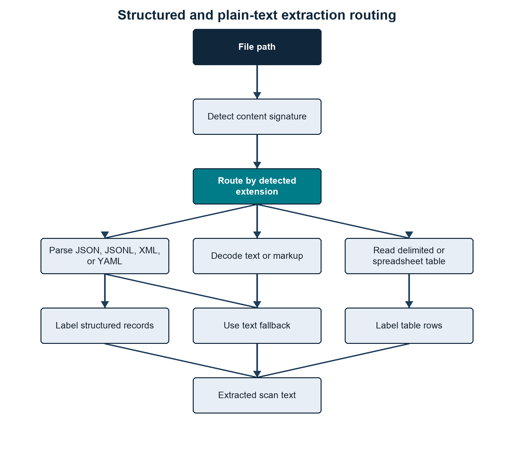{width=80%}

::: {.visual-notes}
**Summary.** Structured and tabular inputs preserve record boundaries by becoming labelled scan units rather than one file-wide text stream. **Methods/context.** Content detection routes JSON, XML, YAML, delimited text, spreadsheets, and ordinary text through format-specific extraction. **Description.** Separate branches show structured-record inference, table labelling, and plain-text decoding before all routes converge on regex scanning. **Statistical details.** Depth, record, and field values are processing limits, not statistical thresholds. **Definitions.** A labelled unit is a flattened record or row whose field names remain adjacent to their values.
:::

### Figure 7: Parser selection determines whether documents yield embedded text, OCR text, or an explicit no-text status

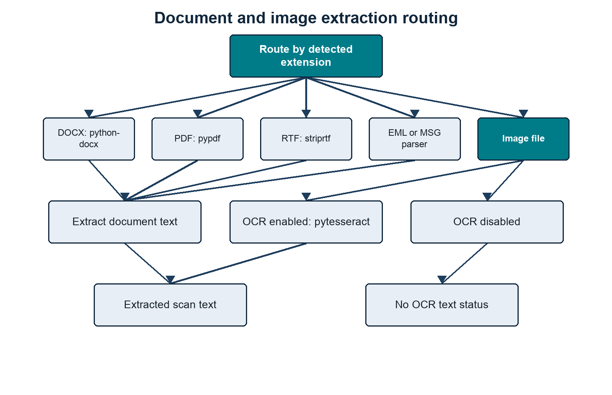{width=80%}

::: {.visual-notes}
**Summary.** Each supported document family has a defined extraction route, and images produce text only when OCR is enabled. **Methods/context.** The scanner selects parsers from the detected content type and records extraction failures or disabled OCR explicitly. **Description.** Document branches identify embedded-text parsers, while the image branch separates OCR-enabled and OCR-disabled outcomes. **Statistical details.** Extraction success is a processing status and no accuracy rate is inferred. **Definitions.** Embedded text is machine-readable content already present in a document; OCR is optical character recognition applied to image pixels.
:::

### Text-Like Files

Text files are decoded with UTF-aware logic:

```text
UTF-16 BOM
UTF-8 BOM
UTF-16-looking byte patterns
UTF-8 fallback with errors ignored
```

Binary-looking files are skipped as `binary_like_content`.

### Structured JSON, JSONL, XML, and YAML

Structured-record processing is enabled by default for `.json`, `.jsonl`, `.xml`, `.yaml`, and `.yml`. Instead of scanning the serialized document as one undifferentiated text block, the scanner parses the hierarchy and emits bounded labelled lines such as:

```text
JSON_RECORD $.export.student | export.source: SIS | export.student.STUDENT_ID: S1234567 | export.student.FIRST_NAME: Jane | export.student.LAST_NAME: Smith | export.student.BIRTH_DATE: 2001-04-12 | full name: Jane Smith
JSON_RECORD $.export.student.email[0] | export.source: SIS | export.student.email.type: home | export.student.email.value: jane@example.com
```

Each emitted line is scanned independently. It therefore becomes the meaningful co-occurrence unit used to build linked evidence, in the same way that one labelled CSV row is treated as a unit. This avoids linking every identifier in a large JSON or XML document merely because it appears in the same file.

#### Parsing by format

- JSON is parsed as one document.
- JSONL is parsed one non-empty source line at a time. Its generated record path retains the original JSONL line number.
- XML is converted into an equivalent nested structure. Attributes use `@attribute` internally, mixed element text uses `#text`, and repeated sibling tags become lists.
- YAML and YML use `yaml.safe_load`; structural YAML processing requires PyYAML.

If structural parsing raises an error, the scanner falls back to its normal text extraction path. JSON, JSONL, YAML, and YML then receive plain-text scanning; XML falls through to markup text extraction. If a valid structured document contains no sufficiently person-like record, its raw text is also scanned. For JSONL, malformed lines are ignored when structured records are successfully emitted from other lines.

#### Record inference

Record boundaries are inferred from both structure and evidence-bearing field names. Keys are humanised across snake case, hyphens, and camel case before scoring. Strong fields include email and common institutional, person, passport, national, NHS, UCAS, CAS, visa, BRP, username, and identifier fields. Supporting fields include names, DOB/birth date, phone, address, postcode, sex, gender, and nationality. Email values, valid UK postcodes, and contextual dates also contribute to the score. The internal evidence score is `3 * strong fields + supporting fields`; a node needs a score of at least `2` before it can be emitted, with additional structural checks deciding where the record boundary sits.

Objects are candidates when they are list items with sufficient evidence, have person-like names such as `student`, `employee`, `patient`, or `applicant`, contain direct identity evidence, or otherwise contain a defensible combination of strong and supporting fields. Fragment containers such as `address`, `contactDetails`, `emails`, `documents`, and `demographics` are normally folded into the nearest person record unless an individual list item is itself a record candidate.

Safe administrative context such as source system, application, case, department, status, timestamps, role, or reference can be inherited by child records. Identity-bearing parent fields are not inherited as generic context, which reduces accidental cross-person linkage.

#### Parent and repeated child records

Some structures make a person node serve two roles at once:

```text
student
  STUDENT_ID
  FIRST_NAME
  LAST_NAME
  BIRTH_DATE
  email[]
  address[]
  programme[]
```

When a parent has enough direct evidence, the scanner emits a parent self-record while excluding nested child-record subtrees from that parent line. It then emits qualifying repeated email, address, or other child records separately. This preserves parent-level demographics and identifiers without collapsing several sibling records into one unsafe mega-record. Non-record child fields may remain attached to the parent, subject to the field limit.

When exactly one qualifying record exists deeper in a weak container, the scanner lets that lower node become the record and passes down only safe context. When first-name and last-name fields resolve uniquely within a record, it also adds a synthesized `full name` field for the existing name rules.

The defaults inspect 12 nesting levels and cap each structured record or XML evidence scope at 200 labelled scalar fields. These limits can be changed with `--structured-max-depth` and `--xml-max-fields`. Structured-record extraction is always enabled in v0.5, and there is no public `--structured-records` or `--structured-max-records` flag. Depth and field caps can omit evidence beyond their limits.

Generated `row_number`, context, and `source_row` values refer to the emitted labelled record line rather than the original pretty-printed JSON, XML, or YAML line layout. Record inference is heuristic and can still produce false boundaries, missed records, false positives, or false negatives.

### CSV and TSV

CSV and TSV files are read as tables when possible.

The first row is initially tested as a header row. If table-column rules recognise genuine headers, rows are converted into labelled text.

If the first row appears to contain data, or no headers are recognised, the scanner samples up to 100 rows and attempts conservative column inference. A type needs at least three non-empty values and at least 80% agreement. Person-table exact value matches are tried first and can type otherwise weak or unknown columns. Standalone validated evidence can identify columns such as email, phone, postcode, National Insurance number, NHS number, passport, CAS, HUSID, SLC ID, SLC/Student SSN, payment card, and bank account. DOB is deliberately not inferred from date-shaped values alone. Unknown or weakly labelled name columns are not inferred from generic “looks like a name” heuristics; first name, last name, and full name are only typed when supported by exact values from `--person-tables` or by explicit recognised source headers. Address columns are inferred only near an inferred postcode column and require at least 80% searchable address components.

When inference succeeds, the original first row is retained as data. Columns that cannot be inferred keep neutral `column_N` labels. If no column meets the thresholds, the raw text is scanned without synthetic headers. Header inference is heuristic and can still miss sparse, highly repetitive, mixed-type, or unusual tables.

### Excel and Spreadsheet Files

Spreadsheet files are converted into labelled table text where possible.

For `.xlsx` and `.xlsm`, the preferred route is `openpyxl` read-only mode.

For other spreadsheet formats, pandas readers are tried with the relevant engine:

```text
.xlsb -> pyxlsb
.ods  -> odf
.xls  -> xlrd
```

There are fallback readers for mislabelled content, including OOXML, HTML tables, delimited text, markup text, and plain text where the bytes are readable.

### Word, PDF, RTF, Email, Images

### Table 4: Each supported document type follows a specific parser or OCR route

| Type | Extractor |
|---|---|
| `.docx` | `python-docx` paragraphs and tables |
| `.pdf` | `pypdf` embedded text |
| `.rtf` | `striprtf` |
| `.eml` | Python email parser |
| `.msg` | `extract_msg` |
| images | `pytesseract`, only when `--scan-images TRUE` |

::: {.visual-notes}
**Summary.** Supported binary and document formats are processed by explicit parser dependencies rather than generic byte decoding. **Methods/context.** Extractor selection follows detected content type, with format-specific fallback handling described in the surrounding text. **Description.** The first column names the file family and the second names the library or conditional OCR route. **Statistical details.** The table reports implementation choices and contains no performance estimates. **Definitions.** An extractor converts a source format into text that can be searched by the evidence engine.
:::

## Table Handling

Tables are handled by turning row data into plain labelled text.

### Figure 8: Canonical header labelling preserves row boundaries while enabling contextual evidence matching

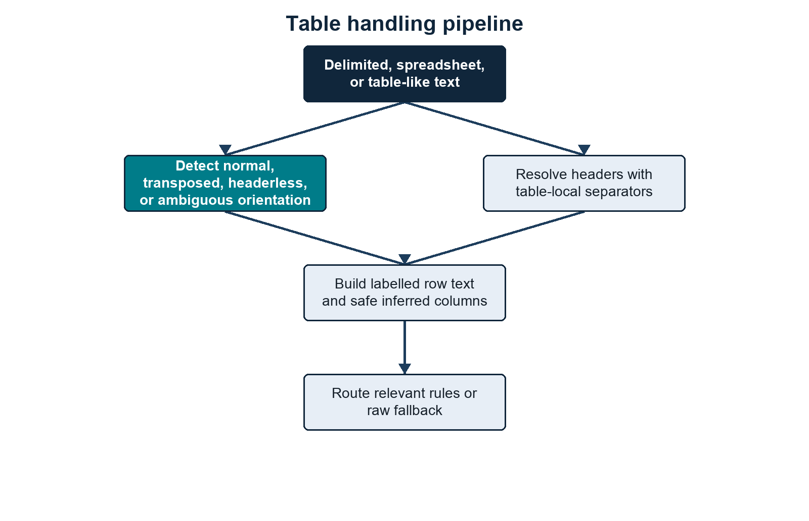{width=80%}

::: {.visual-notes}
**Summary.** Table rows remain separate evidence units while canonical headers supply the context needed by field-sensitive detection rules. **Methods/context.** Header patterns resolve source labels before non-empty cells are serialized as labelled row text. **Description.** The flow shows header recognition, canonicalization, row assembly, code-derived Name and Address handling, and regex matching. **Statistical details.** Header matches are deterministic regex decisions rather than probabilistic classifications. **Definitions.** A canonical header is the standardized field label assigned to one or more source-header variants.
:::

Table-column rules identify field roles as well as providing regex context. Most evidence types are still selected by regex rules, while `Name` and `Address` are assembled directly from recognised structured fields.

Example:

```text
source header: Birth Date
canonical header: dob
labelled text: dob: 2001-04-12
regex match: DOB = 2001-04-12
```

Header separator handling is deliberately table-local. Whitespace is always treated as a word separator. Other punctuation such as `_`, `-`, `~`, `#`, and `|` is used as a header word separator only when splitting that specific label improves recognised header resolution. The scanner does not learn separator semantics from generic `column_N` labels or arbitrary headerless data values. In transposed tables, first-column field labels can also contribute to this table-local separator profile because they are the effective field names after rotation.

Plain-text sources can contain embedded table-shaped blocks without the whole file being a table. The extractor looks for consecutive lines with the same delimiter and field count, validates that the block has table-like value structure, chooses the separator for that block, and rewrites only that block as labelled row text while keeping surrounding prose as plain text. Supported embedded delimiters are comma, tab, semicolon, pipe, tilde, hash, underscore, and hyphen. Underscore and hyphen require stronger table-shape evidence because they are common inside ordinary values, filenames, codes, and prose.

Headerless table handling is value-driven and deliberately conservative. The scanner samples up to 100 rows, keeps the original first row as data when it looks like data, and infers columns only when sampled values agree on a validated type. It can infer common identifiers, email, phone, postcode, address columns adjacent to a postcode, and contextual person rows such as `gender + first name + last name + email`. Name and gender inference in headerless tables requires another person-context column in the same table. Date-shaped headerless columns are not inferred as DOB without explicit birth context.

If a table has `Given Name` and `Family Name`, and the table-column rules mark them as first/last name parts, the scanner assembles:

```text
full name: Given Family
```

That directly emits:

```text
Name = Given Family
```

## Evidence Creation

Evidence is created line by line from extracted text. Recognised name and address fields are assembled first; configured regex rules then process the same line.

For each extracted line:

1. assemble valid names and addresses from recognised labelled fields;
2. start with standalone regex rules;
3. add contextual rules whose `line_triggers` appear in the line;
4. run the selected regexes;
5. use the named capture group `value` if present;
6. otherwise use the whole regex match;
7. run any configured validator;
8. split email evidence into institutional/personal if `--email-suffix` is set;
9. normalise the value;
10. write the atomic evidence row;
11. keep a compact representation for linked-evidence creation.

The atomic evidence fields are:

```text
file_path
file_name
extension
size_bytes
md5
row_number
evidence_type
matched_text
normalized_value
start
end
context
pattern_name
confidence
evidence_tier
matched_person_tables
```

Evidence rows are written into:

```text
4.Regex_Scanning/pii_regex_evidence/
```

The evidence folder contains one CSV per regex/pattern/evidence output bucket, plus:

```text
4.Regex_Scanning/pii_regex_evidence/errors.csv
```

## Value Normalisation

Normalisation is evidence-type specific.

Examples:

```text
Email                  -> lowercase
Institutional Email    -> lowercase
Personal Email         -> lowercase
Phone                  -> whitespace/hyphen removed, uppercase
Address                -> whitespace/hyphen removed, uppercase
IDs/documents/accounts -> whitespace/hyphen removed, uppercase
Other values           -> stripped original value
```

Clustering and person-table matching use normalised values.

## Linked Evidence

A linked-evidence row is normally built from multiple evidence findings on the same extracted line or labelled table row. A single distinct value is also retained when its evidence type is configured as a strong identity anchor, allowing a standalone strong identifier such as an email address to form an identity candidate.

The scanner only creates linked evidence if:

1. the line contains at least two distinct evidence types and one can act as an anchor according to `ANCHOR_PRIORITY`; or
2. the line contains exactly one distinct value whose evidence type is listed in `strong_anchor_types`.

A line containing several values of only one evidence type is not converted into a strong-anchor singleton. This prevents an email distribution list from being treated as one person.

Example linked row:

```text
Name=Jane Smith
DOB=2001-04-12
Institutional Email=jane.smith@example.ac.uk
HUSID=2411841234567
```

Output:

```text
4.Regex_Scanning/linked_evidence.csv
```

Fields:

```text
linked_evidence_key
file_path
file_name
extension
row_number
anchor_type
anchor_value
evidence_types
evidence_values
confidence
risk_level
risk_reasons
cluster_eligible
cluster_exclusion_reason
source_row
duplicate_evidence_group
duplicate_evidence_index
duplicate_evidence_count
duplicate_evidence_paths
duplicate_evidence_locators
duplicate_evidence_action
```

The `duplicate_evidence_*` fields describe semantically identical linked-evidence units when `--duplicate-evidence report` or `--duplicate-evidence collapse` is used. The default `collapse` mode writes one representative linked-evidence row per duplicate evidence group and stores the duplicate paths/locators in these fields. Atomic evidence CSVs remain uncollapsed.

## Linked-Evidence Risk

Linked evidence is scored from the evidence types present in that row.

High-risk examples include:

```text
configured high-risk standalone identifier present
Name + DOB
Email + DOB
an evidence type with the ID risk role + identifying detail
sensitive attribute + identifiable evidence
payment card passing Luhn validation
```

Medium and low risk are assigned when evidence is weaker or less linked.

This row-level risk is later aggregated into cluster/person risk.

## Cluster Eligibility Filtering

Not every linked-evidence row is safe to use for person clustering.

Some rows are list-like, such as:

```text
email: a@example.ac.uk | email: b@example.ac.uk | email: c@example.ac.uk | email: d@example.ac.uk
```

or:

```text
email: a@example.org | email: b@example.org | email: c@example.org | email: d@example.org | email: e@example.org | email: f@example.org
```

Those rows can contain real evidence but are poor identity-merge units.

With `--email-suffix` enabled, the first example exceeds the current three-value limit for `Institutional Email`, while the second exceeds the five-value limit for `Personal Email`. Without an email suffix, the unsplit `Email` rule uses its five-value limit.

The scanner checks `max_per_cluster` on regex rules, but only for evidence types used in:

```text
rules/person_identity_anchors.json
```

If a linked-evidence row has more distinct values of an identity evidence type than allowed, it is marked:

```text
cluster_eligible = no
cluster_exclusion_reason = too_many_<evidence_type>_values:<actual>><limit>
```

Cluster-excluded rows:

1. remain in `4.Regex_Scanning/linked_evidence.csv`;
2. are counted in `4.Regex_Scanning/file_summary.csv`;
3. are excluded from inferred `5.Clustering/clusters.csv`;
4. are still checked against `--person-tables`, because a person-list table can put that evidence back to a known person.

## File Summary

Each processed file gets one row in:

```text
4.Regex_Scanning/file_summary.csv
```

Important fields:

```text
file_path
file_name
extension
detected_extension
size_bytes
md5
sha256
duplicate_content_group
duplicate_content_index
duplicate_of
duplicate_path_count
duplicate_paths
duplicate_content_action
status
text_chars_scanned
finding_count
cluster_excluded_linked_evidence_count
cluster_exclusion_reasons
error
highest_file_risk
evidence_type_counts
count_<evidence_type>
```

`extension` is the filename extension.

`detected_extension` is the content-sniffed extraction route.

`sha256` is populated by default when `--hash-mode` hashes that file. `md5` remains available when `--file-hash md5` is selected for compatibility.

`duplicate_content_group`, `duplicate_content_index`, `duplicate_of`, `duplicate_path_count`, `duplicate_paths`, and `duplicate_content_action` describe byte-identical duplicate-file groups under the selected content hash. With default `--duplicate-files collapse`, duplicate copies are represented in `file_summary.csv` and content-derived evidence is reused for the duplicate path. With `--duplicate-files report`, duplicate copies are represented in `file_summary.csv` as `duplicate_reported` rows but are not extracted or regex-scanned. With `--duplicate-files scan`, every duplicate copy is scanned.

`cluster_excluded_linked_evidence_count` is the number of linked-evidence rows from that file that were excluded from clustering.

`cluster_exclusion_reasons` summarises why those rows were excluded.

## Entity Summary

`4.Regex_Scanning/entity_summary.csv` aggregates by evidence type across the whole scan:

```text
evidence_type
finding_count
file_count
```

It is evidence-type level, not regex-pattern level.

## Regex Summary

`4.Regex_Scanning/regex_summary.csv` aggregates by evidence type and pattern:

```text
evidence_type
pattern_name
finding_count
unique_value_count
file_count
confidence
evidence_tier
not_matched
matched_to_<person-table-stem>...
```

`unique_value_count` counts distinct normalised values for that evidence type and pattern.

When one or more `--person-tables` are supplied, `4.Regex_Scanning/regex_summary.csv` also adds one `matched_to_<person-table-stem>` column per supplied table plus `not_matched`. These counts are taken from the `matched_person_tables` values attached to atomic evidence rows.

This summary links back to rules through:

```text
pattern_name
evidence_type
```

Those values usually come directly from loaded regex rule JSON. Exceptions include email suffix splitting, the code-derived Name and Address patterns, scan-limit metadata, and conditional file-signal rows.

## Person Clustering

The clustering phase merges linked-evidence rows that share strong or defensible compound anchors.

### Figure 9: Strong and compound identity keys merge candidates while unshared evidence remains isolated

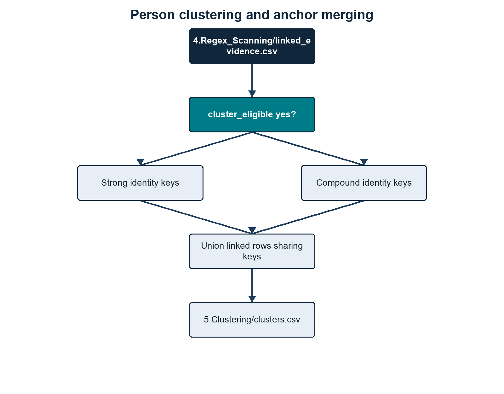{width=80%}

::: {.visual-notes}
**Summary.** Candidates merge only when they share a configured identity key; otherwise they remain isolated singleton clusters. **Methods/context.** Eligible evidence groups receive strong, compound, or fallback singleton keys and are merged with union-find. **Description.** The branches distinguish key construction before converging on connected components and persisted person clusters. **Statistical details.** Cluster confidence is rule-based and must not be interpreted as a probability of identity correctness. **Definitions.** Union-find is an algorithm that groups records connected by shared keys; a singleton contains one unmerged candidate.
:::

Person clustering uses:

```text
rules/person_identity_anchors.json
```

During this phase, `--progress-every` controls status updates. The scanner reports how many candidate rows have been processed out of the retained total, how many are eligible or excluded, how many merge keys have been seen, the number of provisional clusters assembled, and progress while writing `clusters.csv`.

For each cluster-eligible linked-evidence row, the scanner builds merge keys.

### Strong Keys

For each configured strong anchor type:

```text
strong:<Evidence Type>:<Value>
```

Example:

```text
strong:Email:jane.smith@example.ac.uk
```

Rows sharing a strong key are merged.

### Compound Keys

For each configured compound anchor set:

```text
compound:<Type A>+<Type B>:<Value A>:<Value B>
```

Example:

```text
compound:Email+Phone:jane.smith@example.ac.uk:07700900123
```

Rows sharing a compound key are merged.

For `Name`, if both full names and name fragments are present, the clustering key uses full names only.

### Singleton Keys

If no strong or compound key can be built, the linked-evidence row gets a singleton key and becomes its own cluster.

### `clusters.csv`

Fields:

```text
person_cluster_id
cluster_confidence
risk_level
linked_evidence_count
file_count
row_count
anchor_types
anchor_values
cluster_merge_keys
identity_anchor_basis
evidence_types
evidence_values
risk_reasons
file_paths
file_names
source_rows
```

`cluster_merge_keys` is the main audit field for understanding why rows were linked.

`identity_anchor_basis` reports the non-value-bearing identity rule or rules satisfied by the cluster, such as `strong:Institutional Email` or `compound:Phone+Name+Address`. Unlike `anchor_types`, it describes why the cluster qualifies as an inferred identity.

`evidence_values` is useful for review but can be disclosive. It should be handled as sensitive output.

## Known-Person Table Loading

When `--person-tables` is supplied, the scanner loads each CSV and preserves its shape.

The person-table reader decodes the file from bytes before passing it to `csv.DictReader`. It tries UTF encodings first, then Windows-1252 and Latin-1. This is separate from dataset extraction and is specifically to make reference tables exported from Excel or institutional systems usable without manual re-saving.

Each person-list table is read as a flexible CSV, then converted into internal anchors for matching.

### Figure 10: Flexible person-table columns become normalized anchors without losing their original fields

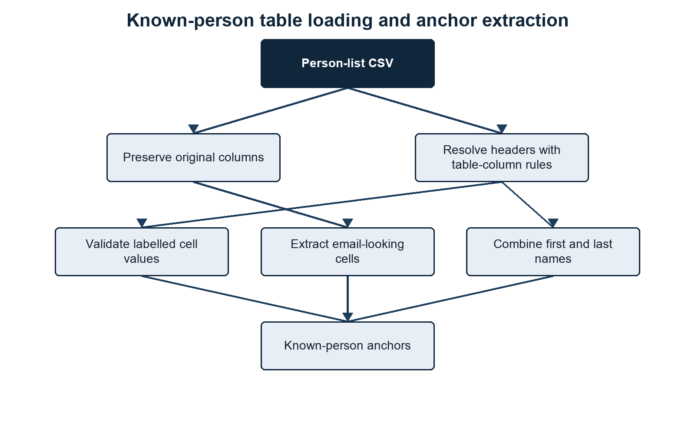{width=80%}

::: {.visual-notes}
**Summary.** Person-table values are normalized for matching while the source columns remain available in known-person reports. **Methods/context.** Decoded CSV rows pass through header resolution, person-key selection, email detection, regex validation, and composite-name assembly. **Description.** The diagram separates source preservation from the construction of internal keys and evidence-type/value anchors. **Statistical details.** Matching is exact after type-specific normalization and does not use fuzzy-match scores. **Definitions.** A person key identifies a reference-table row internally; an anchor is a normalized evidence pair used to associate that row with discovered records.
:::

### Internal Person Key

For each person-table row, the scanner creates an internal `person_key`.

It chooses the first usable value in this order:

1. an exact `ID` column value, because the supplied person table is treated as authoritative for its own primary key;
2. a column whose resolved evidence type is configured as a strong identity anchor;
3. the first email-looking value in any cell;
4. the first non-empty cell value;
5. a fallback such as `person_table_row_12`.

If the key is duplicated inside the same supplied person table, the source rows are merged into one internal person record rather than creating a `#2` suffix key. Repeated `person_table_row_number` values and differing original source values are joined with ` | `. All anchors from the duplicate source rows point to the merged person key.

### Person-Table Anchor Building

For each cell, the scanner:

1. cleans the value;
2. treats an exact `ID` column as an `ID` anchor directly;
3. extracts email-looking values regardless of header;
4. resolves the header through table-column rules;
5. maps exact resolved headers to loaded evidence types where possible;
6. runs loaded regex rules against labelled text like `husid: 2411841234567`;
7. normalises matched values;
8. stores `(evidence_type, normalized_value) -> person_key`.

If a field contains multiple values separated by `|` or `;`, they are split and processed separately.

### First/Last Name Columns

If table-column rules identify first and last name columns using `name_part`, the person table loader uses the same grouped name assembler as structured dataset rows. A simple pair adds:

```text
Name = First Last
```

as a known-person anchor.

Repeated names separated by semicolons, pipes, or spaced slashes are paired positionally. Applicant, guardian, parent, contact, and similar header prefixes keep separate groups. The loader deliberately does not use first-name-only or surname-only values as standalone `Name` anchors when a column is marked as `first` or `last`.

### Original Columns Are Carried Through

Known-person outputs include:

```text
person_key
person_table_row_number
<every original person-table column>
<scanner output fields>
```

This means changing source column names will change output column names, but matching should still work if the table-column rules and regex rules can interpret the headers and values.

## Known-Person Matching

Known-person matching checks three sources:

1. `5.Clustering/clusters.csv`;
2. cluster-excluded rows from `4.Regex_Scanning/linked_evidence.csv`;
3. direct raw evidence rows from `4.Regex_Scanning/pii_regex_evidence/*.csv`.

This is important. A row excluded from inferred clustering can still match a known person if it contains a known email, ID, phone, or other configured anchor. A single raw regex evidence row can also match a known person directly, even when it never became linked evidence.

### Matching a Person Cluster

For each cluster, the scanner checks:

```text
anchor_values
evidence_values
```

against the known-person anchor map.

If any `(evidence_type, value)` pair matches a person-table anchor, the cluster is linked to that known person.

One known person can match multiple `person_cluster_id` values.

### Matching Cluster-Excluded Linked Evidence

For each linked-evidence row where:

```text
cluster_eligible = no
```

the scanner checks its anchors and evidence values against the known-person anchor map.

If it matches, it contributes to:

```text
unclustered_linked_evidence_count
<person-list-stem>_risk_matrix.csv
```

but it does not become a person cluster.

### Matching Direct Raw Evidence

After cluster and cluster-excluded linked-evidence matching, the scanner reads the atomic evidence rows under `4.Regex_Scanning/pii_regex_evidence/*.csv`. Each row is checked against the known-person anchor map using its `(evidence_type, normalized_value)` pair. Direct raw evidence matches add evidence categories, risk-matrix flags, `direct_raw_evidence_count`, and `matched_evidence_count` for that known person.

## Known-Person Outputs

### `<person-list-stem>_in_dataset.csv`

One row per known person who matched at least one cluster, cluster-excluded linked-evidence row, or direct raw evidence row.

The output includes the original person-table columns plus:

```text
person_cluster_ids
matched_cluster_count
unclustered_linked_evidence_count
matched_evidence_count
direct_raw_evidence_count
cluster_confidence
risk_level
linked_evidence_count
file_count
evidence_types
link_anchor_types
link_person_table_fields
```

It intentionally does not include raw `evidence_values` or file paths.

`person_cluster_ids` can contain multiple clusters for one known person. That means the person table linked multiple inferred clusters back to the same known person, but the clusters did not necessarily merge with each other under the configured identity anchors.

`matched_evidence_count` counts distinct raw atomic evidence rows assigned to that known person. It includes raw evidence behind matched clusters, raw evidence behind cluster-excluded linked-evidence rows, and direct raw evidence matches from `pii_regex_evidence/*.csv`.

`direct_raw_evidence_count` is the subset of `matched_evidence_count` that came directly from atomic regex evidence rather than through a linked-evidence row or person cluster.

### `<person-list-stem>_evidence/`

Written only when `--write-person-evidence TRUE` is supplied. One CSV per matched known person.

Each file contains rows with:

```text
record_type = person_cluster
record_type = linked_evidence
record_type = raw_evidence
```

This gives the reviewer both the cluster-level evidence and the raw atomic evidence rows behind the linked evidence for that person.

### `<person-list-stem>_risk_matrix.csv`

One row per person in the supplied person table, including people with no match.

Fields:

```text
person_key
person_table_row_number
<original person-table columns>
overall_risk_score
overall_risk_level
has_<evidence_type>
```

Risk score mapping:

### Table 5: Four fixed risk levels map deterministically to scores from 0 to 90

| Risk level | Score |
|---|---:|
| `none` | 0 |
| `low` | 25 |
| `medium` | 60 |
| `high` | 90 |

::: {.visual-notes}
**Summary.** Categorical exposure risk is converted to one of four fixed numeric values for compact reporting. **Methods/context.** The scanner applies this lookup after rule-based evidence-category scoring. **Description.** Rows progress from no identified risk to high risk, with the corresponding output score in the second column. **Statistical details.** Scores are ordinal reporting constants, not probabilities, percentages, or calibrated expected losses. **Definitions.** `none` means no qualifying evidence category was assigned; higher labels reflect configured evidence combinations.
:::

The `has_*` columns are derived from loaded regex rules plus the code-derived Name and Address definitions.

### `<person-list-stem>_not_in_dataset.csv`

One row per person-table row that did not match any person cluster, cluster-excluded linked-evidence row, or direct raw evidence row.

Includes:

```text
person_key
person_table_row_number
<original person-table columns>
reason
```

### `row_overlap_report/`

When person-table outputs are rebuilt, the scanner also writes a row/person overlap report under:

```text
6.Reidentification/row_overlap_report/
```

The report is designed to show how supplied known-person lists overlap with each other and with the no-list/unknown-person output. The `Persons` metric uses `person_identity_anchors.json`, so person overlap follows the same strong/compound identity-anchor model as the scanner rather than blindly trusting list-specific IDs.

It contains:

```text
row_overlap_presentation.csv
row_overlap_report.html
row_overlap_membership_summary.csv
row_overlap_source_frequency.csv
unverified_evidence_parent_dirs.csv
row_overlap_value_matrix.csv
row_overlap_row_matrix.csv
row_overlap_exact_row_matrix.csv
row_overlap_manifest.json
```

`row_overlap_presentation.csv` is the spreadsheet-style summary: one row per metric with left-only, right-only, both, neither, total verified, total found, and percentage verified counts. `row_overlap_report.html` renders the same information as a lightweight self-contained HTML report with simple visual bars and no JavaScript dependencies. `unverified_evidence_parent_dirs.csv` counts the most common immediate parent folders for unverified/no-list evidence without writing filenames. The remaining CSVs provide pairwise overlap, N-way source-frequency, value-matrix, row-matrix, exact-row-signature, and manifest details. By default these outputs are count-only and do not write raw PII values.

## Unknown-Person Outputs

No-list outputs are produced when `--person-tables` is supplied, because "unknown" means "not found in any supplied person-list table".

### `clusters_not_in_list.csv`

One row per unknown identity that did not match any supplied person table. Most rows are unmatched person clusters that met the configured identity-anchor rules. Strong cluster-excluded linked-evidence identities can also appear here without a `person_cluster_id`, because they were deliberately kept out of inferred clustering but still carry a configured strong identity anchor.

Fields:

```text
unknown_person_key
person_cluster_id
cluster_confidence
risk_level
linked_evidence_count
matched_evidence_count
file_count
evidence_types
cluster_anchor_types
identity_anchor_basis
cluster_anchor_values
cluster_merge_keys
file_paths
reason
```

This output intentionally includes disclosive audit fields so a reviewer can understand why the unknown person exists. Cluster rows include cluster anchor values and merge keys. Cluster-excluded linked-evidence identities may have blank cluster-specific fields.

Clusters that do not meet one of the configured identity-anchor patterns are not promoted into the unknown-person outputs. Cluster-excluded linked-evidence rows are promoted only when they contain a configured strong identity anchor.

### `clusters_not_in_list_redacted.csv`

One row per unknown identity, with direct cluster or linked-evidence audit values removed.

Fields:

```text
unknown_person_key
person_cluster_id
cluster_confidence
risk_level
linked_evidence_count
matched_evidence_count
file_count
evidence_types
cluster_anchor_types
identity_anchor_basis
reason
```

This is the non-disclosive summary view. It keeps the unknown key, optional cluster identity, counts, evidence categories, representative anchor types, and the value-free identity-anchor basis, but omits direct anchor values and merge keys.

`matched_evidence_count` counts the raw atomic evidence rows behind the linked-evidence rows assigned to that unknown identity.

### `Clusters_not_in_list_evidence/`

One CSV per unknown identity.

Each file contains:

```text
record_type = person_cluster
record_type = linked_evidence
record_type = raw_evidence
```

This gives the reviewer the cluster row when present, linked-evidence rows, and the raw evidence rows behind those linked rows.

### `clusters_not_in_list_risk_matrix.csv`

One row per unknown identity.

Fields:

```text
unknown_person_key
person_cluster_id
overall_risk_score
overall_risk_level
has_<evidence_type>
```

## End-To-End Data Flow With Rule Usage

The following figures separate rule loading, scan-stage outputs, and person-stage outputs so each part of the end-to-end flow can be read independently.

### Figure 11: Persisted rule files control evidence classification, risk scoring, and identity linkage at runtime

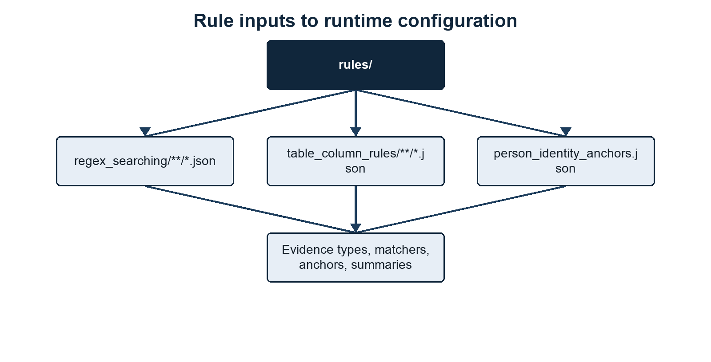{width=80%}

::: {.visual-notes}
**Summary.** Persisted JSON rules are the common source for detection behavior and downstream identity logic. **Methods/context.** Regex, table-column, and person-identity configurations are loaded into validated runtime collections. **Description.** Input blocks on the left feed derived evidence, risk, header, and anchor structures used by scanning and clustering on the right. **Statistical details.** Rule metadata is declarative configuration and is not learned from the scanned dataset. **Definitions.** Runtime configuration is the in-memory compiled representation of the persisted rule files.
:::

### Figure 12: Discovery produces normalized evidence and compatibility summaries before clustering begins

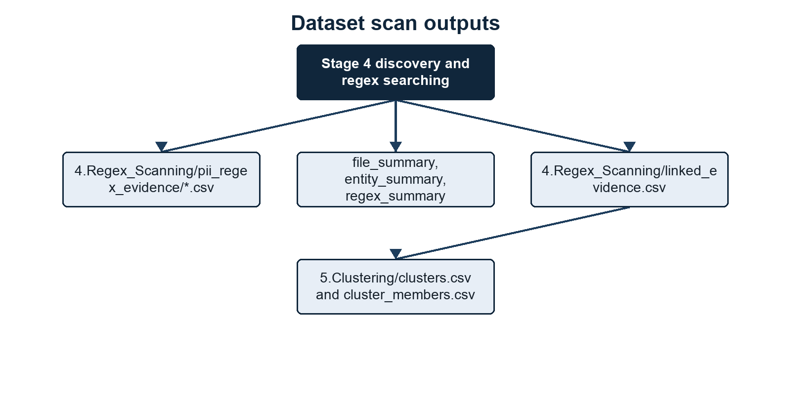{width=80%}

::: {.visual-notes}
**Summary.** Discovery writes atomic evidence CSVs directly and derives review-oriented summaries from those outputs. **Methods/context.** Extracted source units are scanned, normalized, associated with regex provenance, and retained as candidate groups for clustering. **Description.** The output branches distinguish evidence detail, linked evidence, errors, file summaries, aggregate summaries, and downstream clusters. **Statistical details.** Summary totals are descriptive counts of persisted rows and unique normalized values. **Definitions.** Atomic evidence CSVs expose one finding per row for reviewers and comparison tooling.
:::

### Figure 13: Identity-qualified clusters divide into known matches, sanitized unknown summaries, and sensitive audits

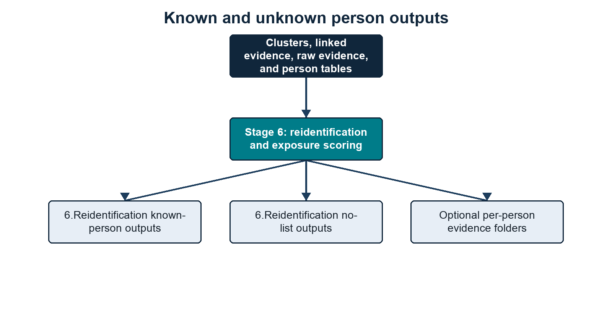{width=80%}

::: {.visual-notes}
**Summary.** Reidentification separates reference-table matches from unmatched identity-qualified clusters and publishes different disclosure levels for each use. **Methods/context.** Cluster anchors are compared with normalized person-table anchors after clustering. **Description.** Output branches cover known-person summaries and matrices, non-disclosive unknown summaries, sensitive cluster audits, unmatched person-list people, and optional evidence detail. **Statistical details.** Match and evidence counts are exact output aggregates; no inferential statistics or fuzzy-match probabilities are reported. **Definitions.** An identity-qualified cluster satisfies at least one configured strong or compound person-identity rule.
:::

## Output Inventory

### Table 6: Direct CSV artefacts support reporting, audit, resume, and compatibility needs

| Output | Built from | Purpose |
|---|---|---|
| `1.File_Preprocessing/file.index.json` | Stage 1 file preprocessing | Reusable file metadata, selected hashes, and duplicate-file grouping inputs. |
| `2.Discovery_Preprocessing/discovery.json` | Stage 2 discovery preprocessing | Worker-ready rule/discovery metadata. |
| `2.Discovery_Preprocessing/person-tables.index.json` | Stage 2 discovery preprocessing | Reusable person-table exact-match index for process workers. |
| `3.Profiling/columns_all_profiles.csv` | Profiling pass or Stage 3 profiling | One row per observed table/structured label, including labels already resolved by current rules. |
| `3.Profiling/columns_unknown_profiles.csv` | Profiling pass or Stage 3 profiling | Unresolved labels with non-disclosive metrics and capped sample previews. |
| `3.Profiling/columns_rule_candidates.csv` | Profiling candidate grouping | Reviewed rule-authoring candidates grouped from unresolved profile rows. |
| `3.Profiling/columns_review_candidates.csv` | Profiling candidate grouping | Meaningful but review-only column candidates that should not automatically become emitted evidence. |
| `3.Profiling/value_type_candidates.csv` | Profiling value-distribution checks | Unresolved columns whose values resemble known types despite weak or generic labels. |
| `3.Profiling/rule_coverage.csv` | Current table-column rules compared with profile observations | Likely stale, rare, or unobserved table-column rules and coverage notes. |
| `3.Profiling/schema_plan.csv` | `--profile integrated` or standalone schema planning | Per-file/per-table/per-column plan: raw header, resolved header, suggested type, confidence, reason, scan action, linking scope, `orientation`, `orientation_confidence`, `orientation_reason`, `detected_separator`, `schema_signature`, and `schema_reused_from`. In `--profile integrated`, actionable rows can drive Stage 4 routing. |
| `3.Profiling/draft_table_column_rules/` | `--profile create_rules` | Draft JSON table-column rules plus `draft_rule_manifest.csv` for manual review before promotion. |
| `4.Regex_Scanning/pii_regex_evidence/` | Regex matches, assembled Name/Address evidence, and file signals | Atomic evidence, one match per row. |
| `4.Regex_Scanning/pii_regex_evidence/errors.csv` | Extraction failures | File-level extraction/parsing errors. |
| `4.Regex_Scanning/linked_evidence.csv` | Same-line/table-row evidence groups | Co-occurrence evidence used for clustering and person-list matching, with duplicate-evidence provenance when configured. |
| `4.Regex_Scanning/file_summary.csv` | Per-file scan result | Counts, risk, detected extension, hashes, duplicate-file metadata, and cluster-exclusion warnings. |
| `4.Regex_Scanning/entity_summary.csv` | All evidence rows | Totals by evidence type. |
| `4.Regex_Scanning/regex_summary.csv` | All evidence rows | Totals, unique values, per-person-table match counts, and `not_matched` by evidence type and pattern. |
| `5.Clustering/clusters.csv` | Cluster-eligible linked evidence | Inferred people and audit keys for identity merging. |
| `5.Clustering/cluster_members.csv` | Cluster-eligible linked evidence | Audit mapping from each cluster to its linked-evidence rows. |
| `6.Reidentification/<person-list-stem>_in_dataset.csv` | Person clusters, cluster-excluded linked evidence, direct raw evidence, and person-list table | Known people found in the scanned dataset, including `matched_evidence_count` and `direct_raw_evidence_count`. |
| `6.Reidentification/<person-list-stem>_risk_matrix.csv` | Known-person exposure categories | One yes/no risk matrix row per supplied person-list row. |
| `6.Reidentification/<person-list-stem>_pii_value_risk_matrix.csv` | Known-person exposure categories plus values | One row per supplied person-list row, with contributing values for matched evidence categories where values can be shown safely. |
| `6.Reidentification/<person-list-stem>_not_in_dataset.csv` | Known-person table minus matches | Known people not found in the scanned dataset. |
| `6.Reidentification/clusters_not_in_list.csv` | Unmatched identity-qualified clusters and strong cluster-excluded linked evidence | Disclosive unknown-identity audit rows, including cluster anchor values and merge keys where a cluster exists. |
| `6.Reidentification/clusters_not_in_list_redacted.csv` | Unmatched identity-qualified clusters and strong cluster-excluded linked evidence | Sanitized unknown-identity summary rows, without direct anchor values. |
| `6.Reidentification/clusters_not_in_list_risk_matrix.csv` | Unknown identities | One yes/no risk matrix row per unknown identity. |
| `6.Reidentification/row_overlap_report/row_overlap_presentation.csv` | Known-person and unknown/no-list outputs | Spreadsheet-style left-only/right-only/both/neither verification summary by metric. |
| `6.Reidentification/row_overlap_report/row_overlap_report.html` | Known-person and unknown/no-list outputs | Self-contained HTML version of the presentation summary with simple figures. |
| `6.Reidentification/row_overlap_report/row_overlap_membership_summary.csv` | Known-person and unknown/no-list outputs | Pairwise membership summary by person-anchor and evidence-value metric. |
| `6.Reidentification/row_overlap_report/row_overlap_source_frequency.csv` | Known-person outputs | N-way source-frequency counts for values present in one, two, or more supplied known-person sources. |
| `6.Reidentification/row_overlap_report/unverified_evidence_parent_dirs.csv` | Unknown/no-list outputs | Count of immediate parent folders containing unverified evidence, without filenames. |
| `6.Reidentification/row_overlap_report/row_overlap_manifest.json` | Report configuration | Identity-anchor config used to define the `Persons` metric. |
| `6.Reidentification/<person-list-stem>_evidence/` | Known-person assignments plus raw evidence | Optional with `--write-person-evidence TRUE`; one CSV per matched known person with cluster, linked-evidence, direct raw-evidence, and raw-evidence detail rows. |
| `6.Reidentification/Clusters_not_in_list_evidence/` | Unknown identities plus raw evidence | Optional with `--write-person-evidence TRUE`; one CSV per unknown identity with cluster rows where present, linked-evidence rows, and raw-evidence detail rows. |
| `7.Reporting/run_manifest.json` | Run configuration and output fingerprints | Resume compatibility metadata for direct-streaming runs. |
| `7.Reporting/run_info.txt` | Runtime counters and timings | Human-readable run metadata and stage totals. |
| `7.Reporting/metadata/process_timing.log` | Worker timing samples | Stage 4 per-file timing diagnostics. |

::: {.visual-notes}
**Summary.** CSV outputs are the authoritative direct-streaming artefacts for review, resume, and reporting. **Methods/context.** Artefacts are generated after discovery, clustering, or reidentification according to their immediate upstream data. **Description.** Columns name each output, identify its source stage or records, and state its intended purpose. **Statistical details.** Counts in these files are descriptive and depend on the selected rules, extraction success, and person table. **Definitions.** Audit outputs retain linkage detail and may be disclosive; summary outputs minimize direct discovered PII where specified.
:::

## Running The Scanner

Full synthetic `breach_dump` run:

```bash
python3 PiiScraper/run_scanner.py \
  --root PiiScraper/tests/synthetic_data/inputs/breach_dump \
  --output-dir PiiScraper/tests/synthetic_data/outputs/breach_dump \
  --person-tables PiiScraper/tests/synthetic_data/inputs/synthetic_slim_contacts.csv \
  --rules PiiScraper/rules \
  --email-suffix example.ac.uk \
  --workers 4
```

Per-person evidence folders are not written by default. Add `--write-person-evidence TRUE` when you want the heavier `<person-list-stem>_evidence/` and `Clusters_not_in_list_evidence/` detail folders.

The scanner executes seven linear stages:

1. file preprocessing;
2. discovery preprocessing;
3. profiling/schema planning when enabled;
4. regex scanning/discovery into direct atomic evidence CSV files;
5. candidate generation and clustering of overlapping/co-occurring evidence;
6. reidentification using person-list information, when `--person-tables` is supplied;
7. reporting and run metadata.

To rebuild from clustering while retaining discovery:

```bash
python3 PiiScraper/run_scanner.py \
  --root PiiScraper/tests/synthetic_data/inputs/breach_dump \
  --output-dir PiiScraper/tests/synthetic_data/outputs/breach_dump \
  --person-tables PiiScraper/tests/synthetic_data/inputs/synthetic_slim_contacts.csv \
  --rules PiiScraper/rules \
  --email-suffix example.ac.uk \
  --resume clustering
```

Use `--resume reidentification` after changing only the person-list table. Use `--resume reporting` to rebuild the built-in overlap/reporting outputs from existing Stage 6 files. Use `--resume scanning` to start at Stage 4 from existing preprocessing/profile artefacts. Changes to extraction behavior should still use a fresh run because source extraction must be repeated.

Full synthetic `exposed_dump` run:

```bash
python3 PiiScraper/run_scanner.py \
  --root PiiScraper/tests/synthetic_data/inputs/exposed_dump \
  --output-dir PiiScraper/tests/synthetic_data/outputs/exposed_dump \
  --person-tables PiiScraper/tests/synthetic_data/inputs/synthetic_slim_contacts.csv \
  --rules PiiScraper/rules \
  --email-suffix example.ac.uk \
  --workers 4
```

Email-only default run:

```bash
python3 PiiScraper/run_scanner.py \
  --root PiiScraper/tests/synthetic_data/inputs/breach_dump \
  --output-dir PiiScraper/tests/synthetic_data/outputs/breach_dump_email_only
```

Image OCR enabled:

```bash
python3 PiiScraper/run_scanner.py \
  --root PiiScraper/tests/synthetic_data/inputs/breach_dump \
  --output-dir PiiScraper/tests/synthetic_data/outputs/breach_dump_ocr \
  --rules PiiScraper/rules \
  --scan-images TRUE
```

Windows-style example:

```bash
python PiiScraper\run_scanner.py ^
  --root C:\LeakedData ^
  --output-dir C:\LeakedData\pii_regex_output ^
  --person-tables C:\LeakedData\person_table.csv ^
  --rules C:\LeakedData\pii_regex_rules ^
  --email-suffix example.ac.uk ^
  --workers 8
```

In PowerShell, use backticks instead of `^`, or put the command on one line.

## Comparing Two Scanner Outputs

The comparison script is:

```text
PiiScraper/reports/Compare_pii_regex_outputs.v0.1.py
```

It compares two completed scanner output folders. It does not rescan source data.

Example:

```bash
python3 PiiScraper/reports/Compare_pii_regex_outputs.v0.1.py \
  PiiScraper/tests/synthetic_data/outputs/breach_dump \
  PiiScraper/tests/synthetic_data/outputs/exposed_dump \
  --person-table PiiScraper/tests/synthetic_data/inputs/synthetic_slim_contacts.csv
```

By default it creates a comparison folder beside the two output folders:

```text
PiiScraper/tests/synthetic_data/outputs/breach_dump_vs_exposed_dump/
```

and writes:

```text
report.txt
known_in_both_datasets.csv
known_only_in_breach_dump.csv
known_only_in_exposed_dump.csv
known_in_neither_dataset.csv
```

Use `--output-dir` to choose a different comparison folder:

```bash
python3 PiiScraper/reports/Compare_pii_regex_outputs.v0.1.py \
  PiiScraper/tests/synthetic_data/outputs/breach_dump \
  PiiScraper/tests/synthetic_data/outputs/exposed_dump \
  --person-table PiiScraper/tests/synthetic_data/inputs/synthetic_slim_contacts.csv \
  --output-dir PiiScraper/tests/synthetic_data/outputs/custom_comparison
```

The report filename is always:

```text
report.txt
```

The comparison report includes count tables, not inline lists of person IDs. The person-level detail is written to the four known-person CSV files.

### What The Comparison Measures

Evidence conservation compares evidence terms:

```text
evidence_type=normalized_value
```

It ignores file path, row number, and source context. For example, if both datasets contain:

```text
Institutional Email=jane.smith@example.ac.uk
```

that evidence term is counted as conserved even if it came from a different file or row in each dataset.

Person-cluster conservation compares cluster identity terms. The script uses `cluster_merge_keys` where present and falls back to anchor/evidence values for singleton-like clusters.

Person-list comparison uses the supplied `--person-table` as the reference universe. The report shows a matrix of:

```text
known in both datasets
known only in the left dataset
known only in the right dataset
known in neither dataset
```

The four known-person detail CSVs carry through the person-table columns and add one column per evidence type. Each evidence-type cell is blank, the left dataset label, the right dataset label, or `both`.

Unknown-person comparison prefers signature terms from the sensitive `clusters_not_in_list.csv` audit output. When only the sanitized `clusters_not_in_list_redacted.csv` exists, the comparison resolves each row to `clusters.csv` by `person_cluster_id` and uses that cluster's non-singleton merge keys or legacy value-bearing fallbacks. The report states which source file was used, how many rows were resolved through the cluster file, and how many rows had no comparable identity terms.

## How To Interpret The Main Outputs

### Start with `file_summary.csv`

Use it to find:

```text
files with extraction_error
files with skipped_extension
files with many findings
files with high risk
files with cluster_excluded_linked_evidence_count > 0
```

`cluster_exclusion_reasons` is useful for spotting rows that look like lists rather than individual records.

### Then inspect `regex_summary.csv`

Use it to understand which regex rules are producing most findings.

`unique_value_count` helps distinguish:

```text
one repeated value many times
many distinct values
```

### Then inspect `linked_evidence.csv`

Use it to see whether evidence is co-occurring sensibly.

Important fields:

```text
evidence_types
evidence_values
cluster_eligible
cluster_exclusion_reason
source_row
```

### Then inspect `clusters.csv`

Use:

```text
cluster_merge_keys
anchor_types
anchor_values
evidence_types
source_rows
```

to understand why linked rows were merged.

### Then inspect person outputs

For person-list people:

```text
<person-list-stem>_in_dataset.csv
<person-list-stem>_risk_matrix.csv
<person-list-stem>_not_in_dataset.csv
```

For inferred unknown people:

```text
clusters_not_in_list_redacted.csv
clusters_not_in_list_risk_matrix.csv
```

## Important Behaviour And Caveats

### Changing Person-Table Column Names

Changing column names in the person table should not break matching if the new names can be resolved by `rules/table_column_rules/**/*.json` or the values are still recognisable by the loaded regex rules.

Examples:

```text
ID                  -> primary key ID anchor
Primary Email       -> email
UoN email           -> email
Other Email(s)      -> email
Student Number      -> student id
Given Name          -> first name
Family Name         -> last name
Birth Date          -> dob
```

The original column names are still carried into outputs.

### Table-Column Rules Versus Regex Rules

Table-column rules identify and standardise headers.

Regex rules identify evidence values.

The table-column rule does not say "this value is definitely a DOB". It says "label this column as dob", then the DOB regex decides whether the value is actually a valid DOB.

### Full Name In Compound Anchors

Use:

```json
["Name", "DOB"]
```

not necessarily:

```json
["Full Name", "DOB"]
```

The evidence type is `Name`; the value can be a full name.

`Full Name` is accepted as an alias to `Name`, but canonical configs should use `Name`.

### Cluster Exclusion Does Not Mean Ignore

Cluster-excluded linked evidence is excluded only from inferred person clustering.

It is still:

```text
reported
summarised
checked against --person-tables
used in known-person risk matrices when matched
```

### A Known Person Can Have Multiple Cluster IDs

This can happen when:

1. several inferred clusters match the same person-table row;
2. the configured identity anchors are intentionally conservative;
3. the evidence did not contain enough shared anchors to merge those clusters automatically.

This is expected. `<person-list-stem>_in_dataset.csv` aggregates them under one known person.

### Names Are Weak Identifiers

Names should not generally be used as standalone strong anchors.

The scanner handles names cautiously by:

```text
not clustering on Name alone unless configured as a strong anchor
using Name mainly in compound anchors
preferring full-name values over first/surname fragments for Name compounds
combining first/last columns only when table-column metadata identifies them
```

### Regex Scanning Can Over-Match

Regex rules can over-match or under-match, especially contextual rules that capture nearby text.

Use:

```text
4.Regex_Scanning/regex_summary.csv
4.Regex_Scanning/linked_evidence.csv
source_row
context
```

to tune rules.

### OCR And PDF Limits

OCR and PDF extraction can produce odd text order or poor-quality text. Human review is still needed for final decisions.

### Sensitive Outputs

These outputs can contain raw PII values:

```text
4.Regex_Scanning/pii_regex_evidence/
4.Regex_Scanning/linked_evidence.csv
5.Clustering/clusters.csv
6.Reidentification/clusters_not_in_list.csv
6.Reidentification/<person-list-stem>_evidence/
6.Reidentification/Clusters_not_in_list_evidence/
```

The two per-person evidence directories only exist when `--write-person-evidence TRUE` is used.

`6.Reidentification/clusters_not_in_list_redacted.csv` and `6.Reidentification/clusters_not_in_list_risk_matrix.csv` are the non-disclosive unknown-person summaries. They contain cluster identifiers, counts, evidence categories, anchor types, risk levels, and evidence flags, but omit direct anchor values, merge keys, evidence values, source rows, and file paths.

Known-person summary outputs deliberately avoid raw `evidence_values` and file paths, but they still contain person-table data and exposure categories, so treat them as sensitive.
